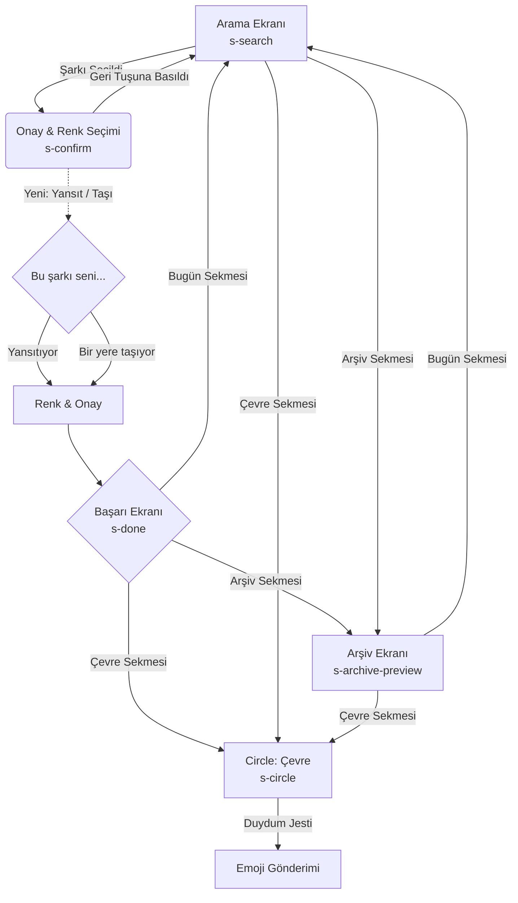

# ONE Color Picker: UX Wireframe & Architecture

Bu doküman, `ONE_color_picker.html` dosyasının Swift/SwiftUI yapısına dönüştürülmüş hali olan uygulamanın UX şemasını ve mimari akışını açıklamaktadır.

## 📱 Ekran Akış Şeması (User Flow)

## 🎨 Ekranlar (Screens)

| Ekran | Açıklama | UI Elementleri | SwiftUI Karşılığı |
| :--- | :--- | :--- | :--- |
| **Search Screen** (`s-search`) | Kullanıcının bugünün şarkısını seçtiği giriş ekranı. Başlık *("Bugün nasıl bir şarkı?")*, arama çubuğu ve sonuç listesi bulunur. | Arama Çubuğu (`TextField`), Sonuç Listesi (`ScrollView`), İkonik Şarkı Listesi Elemanları. | `SearchScreen` View'ı. `vm.filteredSongs` kullanılarak dinamik liste oluşturulur. |
| **Confirm Screen** (`s-confirm`) | Seçilen şarkının onaylandığı ve rengin (hissiyatın) belirlendiği ekran.   **Roadmap - Yansıt / Taşı:** Renk seçimi öncesi şarkının mevcut hissi mi yansıttığı yoksa hissi değiştirmek mi istediği sorulur. | `Geri` butonu, Kapak resmi ve dalgalanan animasyonlu halkalar, Şarkı detayı (Başlık, Sanatçı, Tür), Yansıt/Taşı Segmenti, Renk/Mod Seçiciler (`Grid`), CTA Butonu. | `ConfirmScreen` View'ı. Segmented Control veya iki büyük yönlendirici buton ile "Yansıt / Taşı" kararı alınır. |
| **Done Screen** (`s-done`) | Renk ve şarkının eşleştirilip kaydedildiğini gösteren başarı ekranı. | Büyüyen ok animasyonu (Checkmark), "Kaydedildi" mesajı, Seçilen renk ve hissiyat etiketi. | `DoneScreen` View'ı. `.onAppear` içerisinde `checkAnim` state'i tetiklenerek başarı animasyonu gösterilir. |
| **Archive Screen** (`s-archive-preview`) | Kullanıcının geçmiş günlerdeki kayıtlarını "Wabi-Sabi" felsefesine uygun şekilde gördüğü takvim benzeri ızgara ekran. | "Her gün bir renk." başlığı, 7 sütunlu renk kutuları, Boş günler için kesikli çerçeveli kareler. | `ArchiveScreen` View'ı. `LazyVGrid(columns: 7)` ile oluşturulmuş, boş günler (`nil` veri) için stilize edilmiş kutular içerir. |
| **Circle Screen** (`s-circle`) | **Roadmap - Minimalist Sosyal:** Sadece seçili 8 kişinin "Sabah nabzı" niteliğinde o gün hangi şarkı/rengi seçtiği listelenir. | Kişi Avatarları veya İsim Baş Harfleri, Günün Rengi/Şarkı Mozaik Listesi, "Duydum" Jesti butonu. | Henüz oluşturulmadı. `CircleScreen` View'ı olarak yatay/dikey minimalist bir grid ile eklenecektir. |

## ⚙️ Teknik Yapı & Mimari

SwiftUI yapısı, MVVM (Model-View-ViewModel) desenine uygun olarak tasarlanmıştır.

### **Modeller (Models)**
- `Song`: Şarkı veya sanatçı bilgisi, kapaktaki emoji, gradient renkleri ve gölge rengini barındıran struct.
- `Mood`: Renk paletindeki renk kodunu, duygu kelimesini (örn: "Ateşli", "Boş") ve kontrast yazı rengi (siyah/beyaz) için `isDark` boolean değerini tutan struct.

### **Durum Yönetimi (ViewModel)**
- `ColorPickerViewModel`: Tüm uygulama akışını (`currentScreen`) ve veriyi (seçilen şarkı: `selectedSong`, seçilen duygu rengi: `selectedMood`) kontrol eder.
- Animasyonlar state değişikliklerine (örn. `.search` -> `.confirm`) bağlı olarak otomatik tetiklenir (`.transition()`).

### **Görsel Tasarım & Typografi**
- **Renk Paleti**: Modern, yumuşak "Off-White" arkaplan (`#F7F6F3`)
- **Tipografi**: Apple ekosistemine uyarlanarak, Serif varyasyonları (`Fraunces` referans alınarak) `.custom("Fraunces")` veya muadili olarak kodlanmış, ikincil monospaced textler için `.design(.monospaced)` kullanılmıştır.
- **Micro-Interactions**: Renk seçim butonlarında dokunma büyüme efekti (`.spring()`), kapak fotoğrafı arkasında organik solunum animasyonu (`BreathingAnimation`) eklenmiştir.
- **Dynamic Backgrounds**: CSS'de kullanılan `opacity` ve `radial-gradient` kombinasyonu, uygulamanın durumuna (`selectedMood`) duyarlı `RadialGradient` arka plan katmanı ile kodlanmıştır.

---
*Geliştirme Notu: View'ların düzgün çalışabilmesi için Fraunces fontunun projeye import edilmesi ve sistem tarafından tanımlı olması (Info.plist vs.) gerekmektedir.* 
