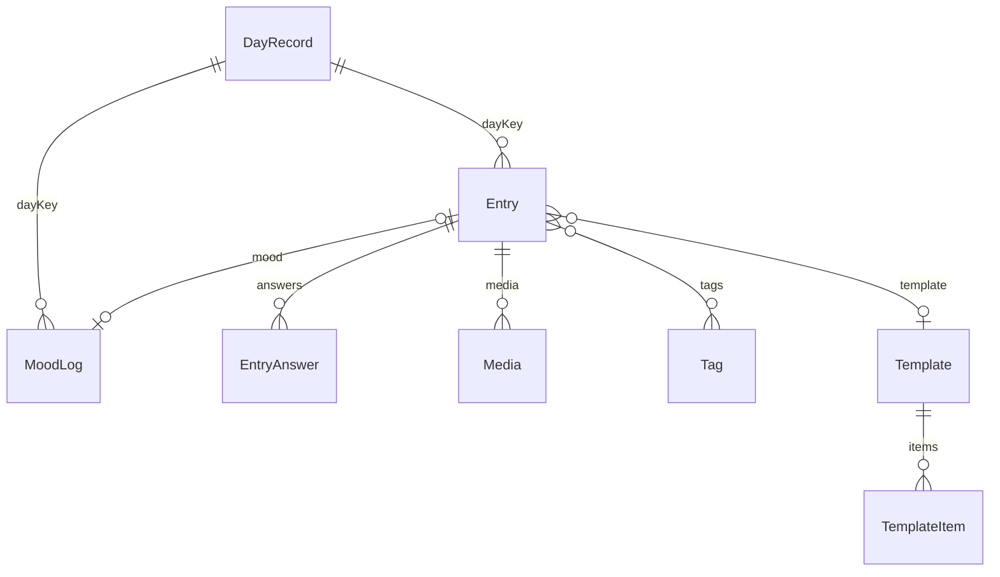

# ONE 2.0 — Veri Modeli v0.2

Durum: AUDIT.md (23 Eyl 2026) sonrası güncellendi. Teardown bulgularıyla v0.3 olacak.
Kapsam: Kullanıcı verisi (CloudKit private DB, `iCloud.com.batu.ones`) ve içerik referansları. İçerik (tema, prompt, rehberli günlük, söz, kataloglar) kullanıcı verisi değil; uzak JSON olarak gelir, kayıtlarda yalnız ID ile geçer.

## v0.1 → v0.2 değişiklikleri

| Değişiklik | Neden (AUDIT) |
|---|---|
| Persistence kararı: **Core Data + mevcut `NSPersistentCloudKitContainer`**, aynı store, yeni model sürümü `one 3` (eklemeli) | Store ve CloudKit mirroring zaten üretimde; SwiftData ikinci bir container ve taşıma riski getirir (R2, R3) |
| `DailySong` entity'si modelde **olduğu gibi kalır**, hiç değiştirilmez | Üretime deploy edilmiş CloudKit şeması silinemez; entity değişirse store açılmaz ve kurtarma yolu yerel veriyi siler (R2, R3) |
| Taşıma seçeneği **B'** eklendi ve önerildi: kopyalamadan, `DailySong` salt okunur okunur | Tek entity, ilişki yok; `Moment`/`Day` struct'ları hazır. Kopyalama işi ve riski sıfır |
| `[String]` alanlar JSON string oldu | CloudKit ile en sorunsuz yol; Transformable'dan kaçınıldı |
| Tüm ilişkiler opsiyonel + ters ilişkili; `Media.entry` opsiyonel | NSPersistentCloudKitContainer kuralı |
| Pas günleri (`passed = true`) taşımaya / istatistiğe girmez | R10 |
| `dayKey` üretim kuralı netleşti | R4 |
| Entity adları kalıcı kabul edildi | CloudKit'te `CD_<Entity>` adıyla üretime gidince yeniden adlandırılamaz |

## Sabit kimlikler (ADR'ye aynen geçecek)

| Kimlik | Değer |
|---|---|
| App bundle ID | `com.batu.ones` |
| CloudKit container | `iCloud.com.batu.ones` |
| App Group | `group.com.batudemir.ones` |
| Widget kind | `MoodWidget` (korunacak) |
| URL scheme | `ones` |

## İlkeler

1. **`dayKey`** (`yyyy-MM-dd`) her yeni kayıtta var; kaydın ait olduğu *yerel* gün. Yeni kayıtta `Calendar.current` ile üretilir ve `timeZoneID` ayrıca saklanır. Geriye dönük doldurmada `dayKey` geçmiş güne, `createdAt` şimdiye ayarlanır.
2. **Türetilen saklanmaz.** Streak, kelime istatistikleri, trendler hesaplanır. Yalnız kazanılmış rozetler (tarihli olay) saklanır.
3. **CloudKit uyumu.** Unique constraint yok; tüm attribute'lar opsiyonel ya da varsayılanlı; tüm ilişkiler opsiyonel ve ters ilişkili; ordered relationship yok (sıra için `order: Int`); büyük ikili veri `allowsExternalBinaryDataStorage` ile (CKAsset).
4. **Mantıksal tekillik kodla.** `DayRecord` gibi "gün başına bir" kayıtlar için `MomentDeduplicator` deseni yeniden yazılır: remote change sonrası aynı `dayKey`'li kayıtlar birleştirilir (en erken `*CompletedAt` kazanır).
5. **Katalog verisi ID ile.** Duygular, nedenler, rozetler ve içerik: kayıtta yalnız string ID.
6. **Silme gerçek silme.** Geri alma ekranda kısa süreli.

## Varlıklar (model sürümü `one 3`)

Model dosyası: `one/one.xcdatamodeld/one 3.xcdatamodel` (23 Eylül 2026). Tablolardaki tipler Swift katmanının gördüğü tiplerdir; modelde CloudKit gereği tüm UUID, Date ve String alanlar opsiyoneldir (`MIGRATION.md` §3). `MoodLog` ve `DayRecord`'a `timeZoneID String?` eklendi. Sınıf adları `<Entity>MO`.

`DayRecord` ↔ diğerleri gerçek ilişki değil; `dayKey` ile sorgulanır (CloudKit'te çakışan `DayRecord` birleştirmesi ilişkileri koparmasın diye).

### Entry

| Alan | Tip | Not |
|---|---|---|
| id | UUID | |
| dayKey | String | |
| timeZoneID | String? | |
| createdAt, updatedAt | Date | |
| kind | String | `freeform`, `prompt`, `guided`, `template`, `dailyCheckIn`, `morning`, `evening`, `emotionCheckIn`, `quoteReflection` |
| title | String? | |
| body | String? | Markdown |
| wordCount | Int32 = 0 | Kaydederken hesaplanır |
| contentRef | String? | `theme:2026-w40:d3`, `guided:gratitude-01` |
| contentSnapshot | String? | Gösterilen sorunun kopyası |
| isBackfilled | Bool = NO | |
| mood | → MoodLog? | inverse `MoodLog.entry` |
| answers | →> EntryAnswer | inverse `EntryAnswer.entry`, cascade |
| media | →> Media | inverse `Media.entry`, cascade |
| tags | <<→> Tag | inverse `Tag.entries`, nullify |
| template | → Template? | inverse `Template.entries`, nullify |

### EntryAnswer

| Alan | Tip | Not |
|---|---|---|
| id | UUID | |
| order | Int16 = 0 | |
| stepRef | String? | İçerik adım ID'si veya TemplateItem ID'si |
| questionSnapshot | String? | |
| kind | String | `text`, `scale5`, `yesNo`, `singleChoice`, `multiChoice`, `focus`, `todo` |
| textValue | String? | |
| numberValue | Double = 0 + `hasNumber` Bool | CloudKit'te scalar opsiyonel yerine bayrak |
| boolValue | Bool = NO + `hasBool` Bool | |
| choiceValuesJSON | String? | `["a","b"]` |
| metricID | String? | `MetricDefinition.id`; ilişki yerine ID (metrik silinse de cevap kalır) |
| entry | → Entry? | |

### MoodLog

| Alan | Tip | Not |
|---|---|---|
| id | UUID | |
| dayKey | String | |
| timestamp | Date | Günde birden çok olabilir |
| score | Int16 = 0 | 1–5; 0 = yok |
| emotionIDsJSON | String? | |
| causeIDsJSON | String? | |
| note | String? | |
| source | String | `launch`, `checkIn`, `emotionCheckIn`, `widget`, `shortcut` |
| healthKitSampleID | String? | HealthKit entitlement yeni eklenecek |
| entry | → Entry? | |

### DayRecord

| Alan | Tip | Not |
|---|---|---|
| id | UUID | |
| dayKey | String | Mantıksal anahtar, dedupe ile tekil |
| dailyCompletedAt, morningCompletedAt, eveningCompletedAt | Date? | |
| focusText | String? | |
| backfilledAt | Date? | |

Streak (taslak): bir gün, seçili ritüel modunda gereken kart(lar) tamamlandıysa "tamam". Seri = bugünden geriye kesintisiz tamam günler. Geriye dönük doldurma günü tamam yapar, seri yeniden hesaplanır. Pencere sınırı teardown'da doğrulanacak. **v3 günleri (`DailySong`) seriye sayılmaz** (öneri; tartışmaya açık).

### Tag

`id` UUID · `name` String · `iconName` String? · `createdAt` Date · `entries` <<→> Entry (inverse)

### Media

| Alan | Tip | Not |
|---|---|---|
| id | UUID | |
| type | String | `photo`, `video`, `audio`, `drawing`, `song` |
| data | Binary, external storage | |
| thumbnail | Binary, external storage | |
| durationSec | Double = 0 | |
| songCatalogID, songTitle, songArtist, artworkURL | String? | MusicKit arama servisi v3'ten çıkarılacak |
| onDeviceDescription | String? | İleride Foundation Models |
| order | Int16 = 0 | |
| entry | → Entry? | |

### Template + TemplateItem (premium)

Template: `id`, `name`, `isFavorite` Bool, `createdAt`, `items` →> TemplateItem (cascade), `entries` →> Entry (nullify)
TemplateItem: `id`, `order` Int16, `kind` (`prompt`, `scale5`, `yesNo`, `text`), `text` String?, `contentRef` String?, `template` → Template?

### MetricDefinition · BadgeAward · Practice

| Entity | Alanlar |
|---|---|
| MetricDefinition | `id`, `name`, `kind` (`scale5`/`yesNo`), `isActive` Bool, `order` Int16 |
| BadgeAward | `id`, `badgeID` String, `earnedAt` Date (aynı `badgeID` için dedupe) |
| Practice | `id`, `contentRef` String, `order` Int16, `addedAt` Date |

## CloudKit dışında

| Veri | Yer |
|---|---|
| Ritüel modu, hatırlatıcı saatleri, ana ekran blokları, streak açık/kapalı, Track Mood on Launch | App Group UserDefaults (`group.com.batudemir.ones`) + `NSUbiquitousKeyValueStore` |
| Widget verisi | App Group UserDefaults köprüsü (mevcut `WidgetDataWriter` deseni; anahtarlar `w2_*` sürümlü). Store App Group'a taşınmaz (R5) |
| İçerik ve kataloglar | Uzak JSON + yerel önbellek; ilk sürüm bundle'da |
| Abonelik | StoreKit 2 (sıfırdan) |
| AI bağlamı | Faz 7 |

## Eski veri: seçenekler

v3'te tek entity var: `DailySong` (28 alan, ilişki yok). Asıl mood verisi `moodColorHex` (serbest renk de olabilir), not `dailyNote`, şarkı alanları, `photoData`, `passed`.

| Seçenek | Ne olur | İş | Risk |
|---|---|---|---|
| A. Tam taşıma | `DailySong` → MoodLog + Entry + Media kopyası | Yüksek | Renk → 1–5 skor eşlemesi keyfi (R9), foto kopyası bellek/süre (R11), çift kayıt |
| B. Arşiv olarak kopyalama | `DailySong` → Entry(kind `legacyMoment`) kopyası | Orta | Kopya + CloudKit'te iki kez veri |
| **B'. Salt okunur okuma (öneri)** | `DailySong` hiç kopyalanmaz. Yolculuk, v3 günlerini mevcut `Moment`/`Day` struct'larıyla "ONE 1" kartları olarak gösterir. Yazma yolu kapatılır. İstatistik ve seriye girmez. Pas günleri gösterilmez | Düşük | Yolculuk'ta iki kaynak birleştirilir (tarih sırasına göre merge) |
| C. Taşımama | v3 verisi görünmez | En düşük | Güncelleme sonrası "verilerim gitti" yorumları |

B' `dayKey` için: `DailySong.date` bileşenlerinden (yerel takvim) türetilir; saat dilimi bilgisi olmadığı için birebir doğruluk garanti değil (R4). Salt görüntüleme olduğu için kabul edilebilir.

Karar: **B'** (Batuhan, 23 Eylül 2026). Tasarım ve riskler: `MIGRATION.md`.

## Açık sorular

- Günde kaç açılış mood check-in'i sayılır (her açılış mı, aralıklı mı)? Teardown ölçecek.
- Duygu kataloğu Apple State of Mind etiketleriyle hizalı mı olsun (HealthKit'e yazmak kolaylaşır)?
- Geriye dönük doldurma penceresi: sınırsız mı, N gün mü?
- `V3Mood` 9 rengi ONE 2.0'da duyguların görsel katmanı olarak kalıyor mu?
- `Entry.body` için veri şifrelemesi mi, yalnız UI kilidi mi (mevcut kilit yalnız UI)?
