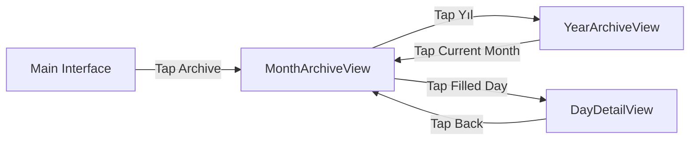
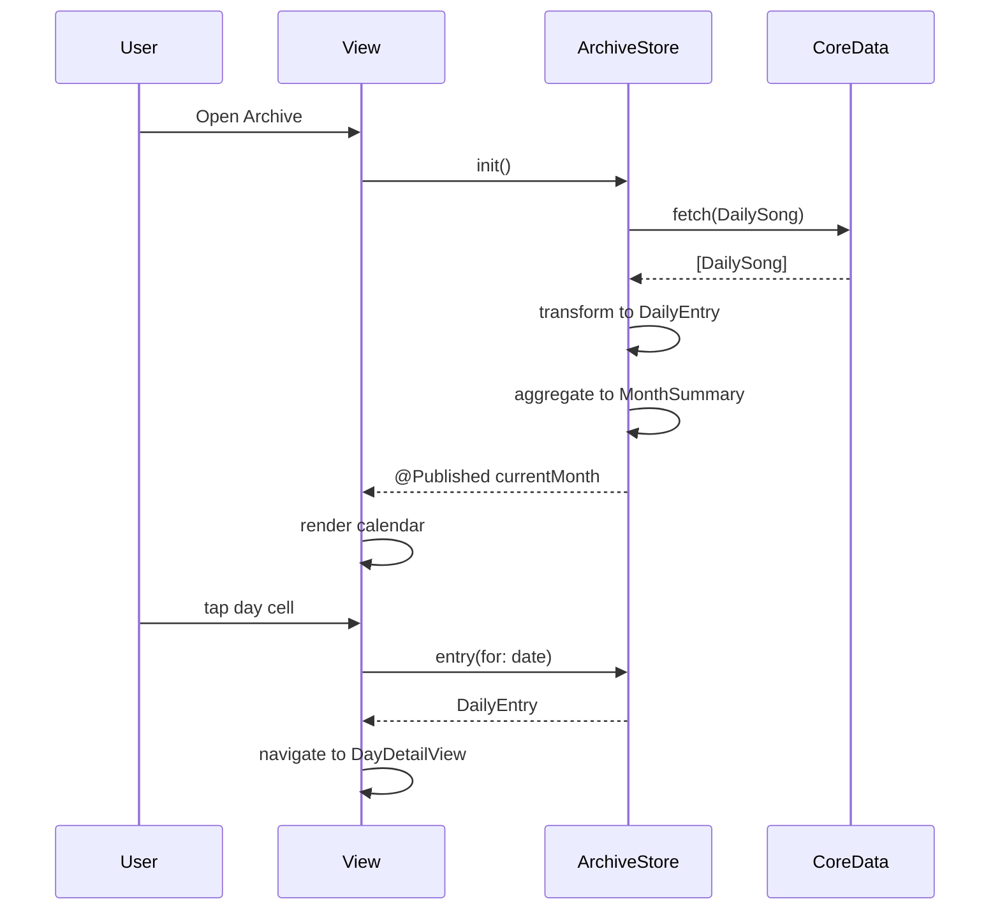

# Design Document: Archive View System

## Overview

The Archive View System provides a comprehensive interface for users to browse, visualize, and interact with their historical daily mood entries in the ONE app. The system consists of three primary views: Month Archive View (calendar grid), Year Archive View (12-month strip), and Day Detail View (comprehensive entry display).

The architecture follows SwiftUI's declarative paradigm with a centralized data store (ArchiveStore) managing CoreData integration and state. The design emphasizes the wabi-sabi aesthetic through carefully chosen typography (Fraunces, GeistMono), muted color palette (#F7F6F3 background, #111112 text), and minimalist visual elements.

Key design principles:
- **Data-driven rendering**: All views derive from MonthSummary and DailyEntry models
- **Lazy loading**: LazyVGrid and LazyVStack optimize performance for large datasets
- **Responsive interactions**: Spring animations, opacity transitions, and gesture feedback
- **Graceful degradation**: Placeholder states for missing photos, disabled buttons for unavailable actions

## Architecture

### High-Level Component Structure

```
┌─────────────────────────────────────────────────────────────┐
│                     Navigation Layer                         │
│  (ContentView → Archive Entry Point → Archive Container)    │
└─────────────────────────────────────────────────────────────┘
                              ↓
┌─────────────────────────────────────────────────────────────┐
│                      ArchiveStore                            │
│  @Published currentMonth: MonthSummary                       │
│  @Published yearData: [MonthSummary]                         │
│  - loadData()                                                │
│  - entry(for: Date) → DailyEntry?                            │
└─────────────────────────────────────────────────────────────┘
                              ↓
                    ┌─────────┴─────────┐
                    ↓                   ↓
┌──────────────────────────┐  ┌──────────────────────────┐
│   MonthArchiveView       │  │   YearArchiveView        │
│  - Header (month/year)   │  │  - 12 Month Rows         │
│  - View Toggle           │  │  - Month Strips          │
│  - Mood Bar Strip        │  │  - Filled Day Counts     │
│  - Wave Strip            │  │                          │
│  - Calendar Grid (7x6)   │  │                          │
└──────────────────────────┘  └──────────────────────────┘
            ↓
┌──────────────────────────┐
│    DayDetailView         │
│  - Back Button           │
│  - Relative Time         │
│  - Photo Section         │
│  - Song Card             │
│  - Mood/Feeling Pills    │
│  - Weather/Time Pills    │
│  - Spotify Button        │
└──────────────────────────┘
```

### Data Flow

1. **Initialization**: ArchiveStore fetches DailySong entities from CoreData on init
2. **Transformation**: CoreData entities → DailyEntry models → MonthSummary aggregations
3. **Publication**: @Published properties trigger SwiftUI view updates
4. **User Interaction**: Tap gestures → Navigation → State updates → Re-render

```
CoreData (DailySong)
    ↓ fetch with date range predicate
ArchiveStore.loadMonth()
    ↓ transform entities
[Date: DailyEntry] dictionary
    ↓ aggregate
MonthSummary (year, month, entries, totalDays)
    ↓ computed properties
orderedDays, calendarCells, moodDistribution
    ↓ render
MonthArchiveView / YearArchiveView
```

## Components and Interfaces

### 1. ArchiveStore (ObservableObject)

**Responsibilities**:
- Fetch DailySong entities from CoreData
- Transform CoreData entities to DailyEntry models
- Aggregate entries into MonthSummary objects
- Provide reactive state for views

**Interface**:
```swift
class ArchiveStore: ObservableObject {
    @Published var currentMonth: MonthSummary
    @Published var yearData: [MonthSummary]
    
    init(context: NSManagedObjectContext)
    func loadData()
    func entry(for date: Date) -> DailyEntry?
    private func loadMonth(year: Int, month: Int) -> MonthSummary
    private func formatTime(_ date: Date) -> String
}
```

**Implementation Details**:
- Uses Calendar.current for date calculations
- Applies NSPredicate for date range filtering: `date >= firstDay AND date < nextMonth`
- Handles nil CoreData attributes with default values
- Formats time using "HH:mm" pattern

### 2. MonthSummary (Struct)

**Responsibilities**:
- Store month metadata and entry dictionary
- Calculate calendar layout properties
- Provide mood distribution statistics

**Interface**:
```swift
struct MonthSummary {
    let year: Int
    let month: Int
    let entries: [Date: DailyEntry]
    let totalDays: Int
    
    var monthName: String
    var monthNameShort: String
    var filledDays: Int
    var moodDistribution: [(color: String, count: Int)]
    var orderedDays: [Date?]
    var calendarCells: [Date?]
}
```

**Computed Properties**:
- `orderedDays`: Inserts nil values at start based on weekday offset: `(weekday + 5) % 7`
- `calendarCells`: Pads orderedDays to multiple of 7 for grid layout
- `moodDistribution`: Groups entries by moodColorHex, counts occurrences

### 3. DailyEntry (Struct)

**Responsibilities**:
- Represent a single day's mood entry
- Map CoreData attributes to SwiftUI-friendly types

**Interface**:
```swift
struct DailyEntry: Identifiable {
    let id: UUID
    let date: Date
    let songName: String
    let artistName: String
    let genre: String
    let moodColor: Color
    let moodColorHex: String
    let moodLabel: String
    let feeling: FeelingType
    let feelingLabel: String
    let time: String
    let photoURL: URL?
    let shareWithCircle: Bool
    let weatherIcon: String
    let weatherDesc: String
    let spotifyURL: URL?
}
```

### 4. MonthArchiveView (View)

**Responsibilities**:
- Render monthly calendar with mood-colored day cells
- Display Mood Bar Strip and Wave Strip visualizations
- Handle day cell tap navigation

**Key Subviews**:
- `headerRow`: Month name (Fraunces 26pt) + Year (GeistMono 10pt)
- `viewToggle`: "Ay" / "Yıl" toggle buttons
- `moodBarStrip`: Proportional mood color segments (GeometryReader for dynamic width)
- `waveStrip`: Vertical bars with mood-based heights (22pt max for #E84040)
- `waveStripMeta`: "1 [Month]" / Song name / "[TotalDays] [Month]"
- `weekdayLabels`: P, S, Ç, P, C, C, P (Monday-start)
- `calendarGrid`: LazyVGrid with 7 columns, 3pt spacing

**State Management**:
```swift
@State private var selectedWaveIdx: Int? = nil
```

**Gesture Handling**:
- Tap on FilledDayCell → `onDayTap(date)` callback
- Tap on wave bar → Update `selectedWaveIdx`, display song name
- Long press on FilledDayCell → Scale to 1.12x with spring animation

### 5. YearArchiveView (View)

**Responsibilities**:
- Display 12 month rows with horizontal day strips
- Show filled day counts per month
- Navigate to MonthArchiveView on current month tap

**Structure**:
```swift
LazyVStack(spacing: 16) {
    ForEach(yearData) { summary in
        HStack {
            Text(summary.monthNameShort) // OCA, ŞUB, MAR...
            HorizontalDayStrip(summary)
            Text("\(summary.filledDays) gün")
        }
        .opacity(isCurrentMonth ? 1.0 : 0.6)
        .onTapGesture { if isCurrentMonth { navigate() } }
    }
}
```

### 6. DayDetailView (View)

**Responsibilities**:
- Display comprehensive day entry information
- Handle Spotify URL opening
- Calculate relative time text

**Layout Sections**:
1. **Back Button**: "← arşiv" (GeistMono 10pt, #BFBDB5)
2. **Relative Time**: "Bugün" / "Dün" / "X gün önce" (GeistMono 9pt, uppercase)
3. **Photo Section**: AsyncImage (152pt height, 16pt radius) or placeholder with "—"
4. **Song Row**: Gradient cover (50x50pt) + song/artist/genre text
5. **Tags Row**: Mood pill (7pt circle + label) + Feeling pill (icon + label)
6. **Extras Row**: Weather pill (icon + desc) + Time pill (clock + time)
7. **Spotify Button**: Green indicator (#1DB954) + "Spotify'da dinle" + "›"

**Conditional Rendering**:
- Photo: `if let url = entry.photoURL { AsyncImage } else { Placeholder }`
- Spotify: `.disabled(entry.spotifyURL == nil)` + `.opacity(0.4)` when nil

### 7. FilledDayCell (View)

**Responsibilities**:
- Render day number with mood color background
- Highlight current day with border

**Styling**:
- Background: `entry.moodColor.opacity(0.85)`
- Corner radius: 8pt
- Aspect ratio: 1:1
- Border: 1.5pt #111112 stroke when `isToday == true`
- Font: GeistMono-Regular 11pt, #111112

### 8. EmptyDayCell (View)

**Responsibilities**:
- Render placeholder for days without entries

**Styling**:
- Background: Transparent
- Border: Dashed #E8E6E0 1pt stroke
- Corner radius: 8pt
- Aspect ratio: 1:1

### 9. FeelingIconView (View)

**Responsibilities**:
- Render custom icons for 8 feeling types

**Supported Types**:
- calm, happy, sad, anxious, excited, tired, angry, peaceful

**Styling**:
- Size: 22x17pt
- Stroke color: #555555
- Stroke width: 1.5pt

## Data Models

### CoreData Schema (DailySong Entity)

```
DailySong
├── id: UUID
├── date: Date
├── songName: String
├── artistName: String
├── genre: String
├── moodColorHex: String
├── moodLabel: String
├── moodWord: String (legacy)
├── feeling: String (enum raw value)
├── feelingLabel: String
├── photoURL: String (optional)
├── spotifyURL: String (optional)
├── weatherIcon: String
├── weatherDesc: String
├── shareWithCircle: Bool
└── ... (other attributes)
```

### Swift Models

**DailyEntry**:
- Immutable struct
- All properties are let constants
- Optional properties: photoURL, spotifyURL
- Color conversion: `Color(hex: moodColorHex)`

**MonthSummary**:
- Immutable struct with computed properties
- entries dictionary keyed by startOfDay dates
- Lazy evaluation of orderedDays and moodDistribution

**FeelingType (Enum)**:
```swift
enum FeelingType: String, CaseIterable {
    case calm, happy, sad, anxious, excited, tired, angry, peaceful
}
```

### Data Transformation Pipeline

```
DailySong (CoreData)
    ↓ ArchiveStore.loadMonth()
DailyEntry (Swift struct)
    ↓ Dictionary grouping
[Date: DailyEntry]
    ↓ MonthSummary init
MonthSummary
    ↓ Computed properties
orderedDays: [Date?]
calendarCells: [Date?]
moodDistribution: [(String, Int)]
```

## State Management

### ArchiveStore as Single Source of Truth

- **@Published properties**: Trigger view updates on data changes
- **Initialization timing**: loadData() called in init, runs synchronously
- **Context injection**: Accepts NSManagedObjectContext for testability

### View-Level State

**MonthArchiveView**:
- `@State private var selectedWaveIdx: Int?`: Tracks selected wave bar for metadata display

**Navigation State**:
- Managed by SwiftUI NavigationStack
- NavigationLink destinations: DayDetailView
- Programmatic navigation: Toggle between Month/Year views

### State Flow Example

```
User taps wave bar at index 3
    ↓
selectedWaveIdx = 3
    ↓
SwiftUI re-renders waveStripMeta
    ↓
Displays entry.songName with .opacity transition
```


## UI/UX Implementation Details

### Typography System

**Fraunces-Regular** (Serif, display font):
- 26pt: Month names in MonthArchiveView header
- 20pt: Song names in DayDetailView
- 18pt: Month abbreviations in YearArchiveView
- Tracking: -0.4 to -0.5 (tighter for larger sizes)
- Weight: Light

**GeistMono-Regular** (Monospace, metadata font):
- 11pt: Day numbers in calendar cells
- 10.5pt: Artist/genre in song cards
- 10pt: Year labels, back button, Spotify button
- 9pt: Mood/feeling/weather labels, toggle buttons, filled day counts
- 8pt: Wave strip metadata, weekday labels
- Tracking: 0.4 to 2.0 (wider for smaller sizes)

### Color Palette

**Backgrounds**:
- Primary: #F7F6F3 (warm off-white)
- Pill background: #EEECEA (light gray)
- Toggle active: #111112 (near black)

**Text Colors**:
- Primary: #111112 (near black)
- Secondary: #BFBDB5 (medium gray)
- Tertiary: #D0CEC8 (light gray)
- Metadata: #888888, #999999 (mid grays)

**Borders**:
- Primary: #E0DED9 (light beige)
- Dashed: #E8E6E0 (lighter beige)
- Current day: #111112 (near black, 1.5pt)

**Mood Colors** (8 emotions):
- Angry: #E84040 (red)
- Excited: #FF8C42 (orange)
- Happy: #F5C842 (yellow)
- Calm: #4CAF82 (green)
- Peaceful: #5B8DEF (blue)
- Anxious: #9B7FD4 (purple)
- Tired: #607D8B (gray-blue)
- Sad: #2C2C2C (dark gray)

**Accent Colors**:
- Spotify: #1DB954 (green)

### Spacing and Layout

**Padding**:
- MonthArchiveView: 52pt top, 22pt horizontal, 80pt bottom
- DayDetailView: 54pt top, 24pt horizontal
- Pills: 12pt horizontal, 6pt vertical
- Buttons: 16pt horizontal, 13pt vertical

**Spacing**:
- Calendar grid: 3pt between cells
- Wave strip bars: 1pt between bars
- Mood bar segments: 2pt between segments
- Pill groups: 8pt between pills
- Section spacing: 10-16pt vertical

**Sizing**:
- Day cells: 1:1 aspect ratio (flexible width)
- Photo: 152pt height, 16pt corner radius
- Song cover: 50x50pt, 12pt corner radius
- Mood circle: 7pt diameter
- Feeling icon: 22x17pt
- Spotify indicator: 8pt diameter

### Visual Hierarchy

1. **Primary**: Month name (Fraunces 26pt, #111112)
2. **Secondary**: Song names (Fraunces 20pt), day numbers (GeistMono 11pt)
3. **Tertiary**: Metadata labels (GeistMono 8-10pt, #BFBDB5-#D0CEC8)
4. **Accent**: Mood colors (0.7-0.85 opacity), Spotify green

### Responsive Behavior

**GeometryReader Usage**:
- Mood Bar Strip: Calculate segment widths proportionally
- Wave Strip: Calculate bar widths based on available space

**LazyVGrid/LazyVStack**:
- Defer rendering until cells are visible
- Maintain scroll position on navigation return

**Adaptive Sizing**:
- Calendar cells: Flexible width, fixed aspect ratio
- Wave bars: Dynamic width, fixed heights per mood

## SwiftUI View Hierarchy

```
NavigationStack
└── ArchiveContainerView
    ├── MonthArchiveView(summary: currentMonth)
    │   ├── ScrollView
    │   │   └── VStack
    │   │       ├── headerRow (HStack)
    │   │       ├── viewToggle (HStack)
    │   │       ├── moodBarStrip (GeometryReader → HStack)
    │   │       ├── waveStrip (GeometryReader → HStack)
    │   │       ├── waveStripMeta (HStack)
    │   │       ├── weekdayLabels (LazyVGrid)
    │   │       └── calendarGrid (LazyVGrid)
    │   │           ├── FilledDayCell (if entry exists)
    │   │           ├── EmptyDayCell (if no entry)
    │   │           └── Color.clear (if nil date)
    │   └── NavigationLink → DayDetailView
    │
    └── YearArchiveView(yearData: yearData)
        └── ScrollView
            └── LazyVStack
                └── ForEach(12 months)
                    └── MonthRowView
                        ├── Text(monthNameShort)
                        ├── HorizontalDayStrip
                        └── Text(filledDays)

DayDetailView(entry: DailyEntry)
└── ZStack
    ├── Color(#F7F6F3).ignoresSafeArea()
    └── ScrollView
        └── VStack
            ├── Button("← arşiv")
            ├── Text(daysAgoText)
            ├── photoSection (AsyncImage or Placeholder)
            ├── songRow (HStack)
            ├── tagsRow (HStack)
            │   ├── Mood pill (Capsule)
            │   └── Feeling pill (Capsule)
            ├── extrasRow (HStack)
            │   ├── Weather pill (Capsule)
            │   └── Time pill (Capsule)
            └── spotifyButton (Button)
```

## CoreData Integration Strategy

### Fetch Strategy

**Predicate-Based Filtering**:
```swift
NSPredicate(
    format: "date >= %@ AND date < %@",
    firstDay as NSDate,
    nextMonthFirstDay as NSDate
)
```

**Fetch Request Configuration**:
- Entity: DailySong
- Sort descriptors: None (dictionary keyed by date)
- Batch size: Not set (monthly data is small)

### Data Transformation

**CoreData → Swift Model**:
```swift
DailyEntry(
    id: item.id ?? UUID(),
    date: item.date ?? Date(),
    songName: item.songName ?? "Bilinmeyen Şarkı",
    // ... with nil coalescing for all optional attributes
)
```

**Date Normalization**:
- Use `Calendar.startOfDay(for:)` to normalize timestamps
- Dictionary keys are always midnight dates

### Error Handling

**Fetch Errors**:
```swift
do {
    let items = try context.fetch(fetchRequest)
} catch {
    print("❌ Arşiv yükleme hatası: \(error)")
    return MonthSummary(year: year, month: month, entries: [:], totalDays: 30)
}
```

**Missing Attributes**:
- Use nil coalescing: `item.songName ?? "Bilinmeyen Şarkı"`
- Provide sensible defaults for all optional fields

### Performance Considerations

**Lazy Loading**:
- Only fetch data for visible months
- Year view fetches all 12 months on init (acceptable for yearly data)

**Caching**:
- MonthSummary objects cached in ArchiveStore.yearData
- No need for additional caching layer (data is already aggregated)

**Memory Management**:
- DailyEntry structs are lightweight (no large binary data)
- Photos loaded via AsyncImage (automatic memory management)

## Animation and Interaction Design

### Gesture Interactions

**Tap Gestures**:
- FilledDayCell: Navigate to DayDetailView
- EmptyDayCell: No action
- Wave bar: Update selectedWaveIdx
- Toggle button: Switch between Month/Year views
- Spotify button: Open URL (if available)

**Long Press Gesture**:
```swift
.onLongPressGesture {
    withAnimation(.spring(response: 0.3, dampingFraction: 0.6)) {
        scale = 1.12
    }
}
```

### Animations

**Spring Animation** (Day cell long press):
- Response: 0.3s
- Damping: 0.6
- Scale: 1.0 → 1.12

**Ease In/Out** (Wave strip metadata):
- Duration: 0.2s
- Curve: easeInOut
- Property: opacity

**Opacity Transition** (Song name in wave strip):
```swift
.transition(.opacity)
.animation(.easeInOut(duration: 0.2), value: selectedWaveIdx)
```

### Visual Feedback

**Hover States**: Not applicable (iOS touch interface)

**Active States**:
- Toggle button: #111112 background, #F7F6F3 text
- Wave bar: 1.0 opacity when selected, 0.72 when not

**Disabled States**:
- Spotify button: 0.4 opacity when URL is nil
- Year view months: 0.6 opacity when not current month

## Mermaid Diagrams

### Data Flow Diagram

```mermaid
graph TD
    A[CoreData: DailySong] -->|NSFetchRequest| B[ArchiveStore]
    B -->|Transform| C[DailyEntry Models]
    C -->|Aggregate| D[MonthSummary]
    D -->|@Published| E[MonthArchiveView]
    D -->|@Published| F[YearArchiveView]
    E -->|Navigation| G[DayDetailView]
    B -->|entry for:| G
```

### View Navigation Flow



### State Management Flow




## Correctness Properties

*A property is a characteristic or behavior that should hold true across all valid executions of a system—essentially, a formal statement about what the system should do. Properties serve as the bridge between human-readable specifications and machine-verifiable correctness guarantees.*

### Property Reflection

After analyzing all acceptance criteria, I identified the following redundancies:

- **Cell rendering properties (2.4, 2.5)** can be combined into a single property about cell type selection
- **Wave bar opacity properties (4.6, 4.7)** can be combined into a single property about selection state
- **Spotify button state properties (10.2, 10.3)** can be combined into a single property about conditional enabling
- **Month name properties (12.2, 12.3)** can be combined into a single property about Turkish month name mapping
- **Feeling icon properties (14.2, 14.3, 14.4, 14.5)** can be combined into a single property about icon rendering
- **Error handling properties (19.1, 19.2)** are already covered by other properties (9.4, 10.3)
- **Scroll position properties (6.4, 15.6)** are redundant - same behavior
- **Day cell aspect ratio properties (13.4, 13.8)** can be combined

The following properties provide unique validation value and will be included:

### Property 1: Calendar Grid Offset Calculation

*For any* month, the calendar grid offset (number of nil values at the start of orderedDays) should equal `(firstDayWeekday + 5) % 7`, where firstDayWeekday is the weekday component of the month's first day.

**Validates: Requirements 2.8, 12.7, 12.8**

### Property 2: Day Cell Type Selection

*For any* date in the calendar grid, if an entry exists for that date, a FilledDayCell should be rendered; otherwise, an EmptyDayCell should be rendered.

**Validates: Requirements 2.4, 2.5**

### Property 3: Mood Bar Proportional Width

*For any* month with filled days, each mood color segment in the Mood Bar Strip should have width proportional to its occurrence count divided by total filled days, with a minimum width of 3pt enforced.

**Validates: Requirements 3.2, 3.3, 3.7**

### Property 4: Wave Strip Day Count

*For any* month, the Wave Strip should display exactly totalDays bars in chronological order, where totalDays is calculated using `Calendar.range(of: .day, in: .month)`.

**Validates: Requirements 4.1**

### Property 5: Wave Strip Height Mapping

*For any* filled day in the Wave Strip, the bar height should match the mood color mapping: #E84040→22pt, #FF8C42→20pt, #F5C842→16pt, #4CAF82→14pt, #5B8DEF→18pt, #9B7FD4→16pt, #607D8B→10pt, #2C2C2C→8pt.

**Validates: Requirements 4.2**

### Property 6: Wave Strip Empty Day Rendering

*For any* empty day in the Wave Strip, the bar should have 4pt height, #EEECEA color, and 0.6 opacity.

**Validates: Requirements 4.3**

### Property 7: Wave Strip Selection State

*For any* bar in the Wave Strip, if it is selected (index matches selectedWaveIdx), it should display at 1.0 opacity; otherwise, it should display at 0.72 opacity.

**Validates: Requirements 4.6, 4.7**

### Property 8: Wave Strip Tap Interaction

*For any* tapped bar in the Wave Strip, the selectedWaveIdx state should update to that bar's index, and if the bar represents a filled day, the corresponding song name should display in the metadata row.

**Validates: Requirements 4.8, 5.4**

### Property 9: Filled Day Cell Navigation

*For any* FilledDayCell tap, the system should navigate to DayDetailView with the correct date parameter matching the tapped cell's date.

**Validates: Requirements 6.1**

### Property 10: Empty Day Cell No-Op

*For any* EmptyDayCell tap, no navigation or state change should occur.

**Validates: Requirements 6.3**

### Property 11: Scroll Position Preservation

*For any* navigation from MonthArchiveView to DayDetailView and back, the scroll position should be preserved (same scroll offset before and after).

**Validates: Requirements 6.4, 15.6**

### Property 12: Year View Month Count Display

*For any* month in YearArchiveView, the displayed filled day count should equal the number of entries in that month's entries dictionary.

**Validates: Requirements 8.4**

### Property 13: Year View Non-Current Month Interaction

*For any* non-current month row tap in YearArchiveView, no navigation or state change should occur.

**Validates: Requirements 8.8**

### Property 14: Relative Time Calculation

*For any* DailyEntry date, the relative time text should be "Bugün" if 0 days ago, "Dün" if 1 day ago, or "X gün önce" if X days ago (where X > 1).

**Validates: Requirements 9.2**

### Property 15: Photo Display Conditional

*For any* DailyEntry, if photoURL is non-nil, an AsyncImage should be displayed; if photoURL is nil, a placeholder with #EEECEA background and "—" symbol should be displayed.

**Validates: Requirements 9.3, 9.4, 19.1**

### Property 16: Day Detail Pill Structure

*For any* DailyEntry displayed in DayDetailView, all pills (mood, feeling, weather, time) should have #EEECEA background, capsule shape, and contain their respective icons/labels in GeistMono-Regular 9pt.

**Validates: Requirements 9.6, 9.7, 9.8, 9.9, 9.10**

### Property 17: Spotify Button State

*For any* DailyEntry, if spotifyURL is non-nil, the Spotify button should be enabled with 1.0 opacity; if spotifyURL is nil, the button should be disabled with 0.4 opacity.

**Validates: Requirements 10.2, 10.3, 19.2**

### Property 18: Spotify Button Action

*For any* enabled Spotify button tap, UIApplication.shared.open should be called with the entry's spotifyURL.

**Validates: Requirements 10.4**

### Property 19: CoreData Date Range Filtering

*For any* month load operation, the CoreData fetch request should use a predicate filtering DailySong entities where `date >= firstDayOfMonth AND date < firstDayOfNextMonth`.

**Validates: Requirements 11.5, 20.5**

### Property 20: DailySong to DailyEntry Transformation

*For any* DailySong entity fetched from CoreData, it should be transformed into a DailyEntry with all attributes mapped correctly, using default values for nil attributes (e.g., "Bilinmeyen Şarkı" for nil songName).

**Validates: Requirements 11.6, 17.4**

### Property 21: Month Total Days Calculation

*For any* month, the totalDays value should equal the result of `Calendar.range(of: .day, in: .month, for: firstDayOfMonth).count`, or 30 if the calculation fails.

**Validates: Requirements 11.7, 19.5**

### Property 22: Entry Lookup by Date

*For any* date with an existing entry, calling `ArchiveStore.entry(for: date)` should return the DailyEntry for that date's startOfDay; for dates without entries, it should return nil.

**Validates: Requirements 11.8**

### Property 23: Turkish Month Name Mapping

*For any* month number (1-12), MonthSummary should return the correct Turkish month name (full and abbreviated): 1→Ocak/OCA, 2→Şubat/ŞUB, 3→Mart/MAR, 4→Nisan/NİS, 5→Mayıs/MAY, 6→Haziran/HAZ, 7→Temmuz/TEM, 8→Ağustos/AĞU, 9→Eylül/EYL, 10→Ekim/EKİ, 11→Kasım/KAS, 12→Aralık/ARA.

**Validates: Requirements 12.2, 12.3**

### Property 24: Filled Days Count

*For any* MonthSummary, the filledDays property should equal the count of entries in the entries dictionary.

**Validates: Requirements 12.4**

### Property 25: Mood Distribution Calculation

*For any* MonthSummary, the moodDistribution array should contain tuples of (moodColorHex, count) where count equals the number of entries with that moodColorHex, and the sum of all counts equals filledDays.

**Validates: Requirements 12.5**

### Property 26: Ordered Days Array Structure

*For any* MonthSummary, the orderedDays array should start with N nil values (where N is the calendar offset), followed by totalDays Date values in chronological order.

**Validates: Requirements 12.6**

### Property 27: Calendar Cells Padding

*For any* MonthSummary, the calendarCells array length should be a multiple of 7, achieved by padding orderedDays with trailing nil values.

**Validates: Requirements 12.9**

### Property 28: Filled Day Cell Mood Color

*For any* FilledDayCell, the background color should be the entry's moodColor at 0.85 opacity.

**Validates: Requirements 13.2**

### Property 29: Day Cell Aspect Ratio

*For any* day cell (filled or empty), the aspect ratio should be 1:1.

**Validates: Requirements 13.4, 13.8**

### Property 30: Current Day Border Highlight

*For any* FilledDayCell where isToday is true, a #111112 1.5pt stroke border should be displayed.

**Validates: Requirements 13.5**

### Property 31: Feeling Icon Rendering

*For any* FeelingType, the FeelingIconView should render a unique icon at 22x17pt size with #555555 stroke color and 1.5pt stroke width.

**Validates: Requirements 14.2, 14.3, 14.4, 14.5**

### Property 32: Long Press Scale Animation

*For any* FilledDayCell long press, the cell should animate to 1.12x scale with spring animation (response: 0.3s, damping: 0.6).

**Validates: Requirements 16.1**

### Property 33: Wave Strip Selection Animation

*For any* wave strip selection change, the metadata text should animate with 0.2s easeInOut duration using opacity transition.

**Validates: Requirements 16.2**

### Property 34: Time Formatting

*For any* Date, the ArchiveStore should format the time component as "HH:mm" (24-hour format with leading zeros).

**Validates: Requirements 17.5**

### Property 35: Empty Month Rendering

*For any* month with no entries (entries dictionary is empty), the MonthArchiveView should display all EmptyDayCells in the calendar grid.

**Validates: Requirements 19.3**

### Property 36: CoreData Fetch Error Handling

*For any* CoreData fetch failure, the ArchiveStore should log the error and return a MonthSummary with an empty entries dictionary.

**Validates: Requirements 19.4**

### Property 37: Nil Date Transparent Cell

*For any* nil date in the calendarCells array, a transparent Color.clear view with 1:1 aspect ratio should be rendered.

**Validates: Requirements 19.6**

### Property 38: Month Summary Caching

*For any* repeated access to the same month's data, the ArchiveStore should return the cached MonthSummary from yearData without re-fetching from CoreData.

**Validates: Requirements 20.4**


## Error Handling

### CoreData Fetch Failures

**Strategy**: Graceful degradation with empty state

```swift
do {
    let items = try context.fetch(fetchRequest)
    // Process items...
} catch {
    print("❌ Arşiv yükleme hatası: \(error)")
    return MonthSummary(year: year, month: month, entries: [:], totalDays: 30)
}
```

**Behavior**:
- Log error to console for debugging
- Return MonthSummary with empty entries dictionary
- Use default totalDays value of 30
- UI displays all EmptyDayCells (valid empty state)

### Missing CoreData Attributes

**Strategy**: Nil coalescing with sensible defaults

```swift
DailyEntry(
    id: item.id ?? UUID(),
    songName: item.songName ?? "Bilinmeyen Şarkı",
    artistName: item.artistName ?? "Bilinmeyen Sanatçı",
    moodColorHex: item.moodColorHex ?? "#607D8B",
    feeling: FeelingType(rawValue: item.feeling ?? "calm") ?? .calm,
    // ...
)
```

**Default Values**:
- Strings: Localized placeholder text ("Bilinmeyen Şarkı", "Bilinmeyen Sanatçı")
- Colors: Neutral gray (#607D8B)
- Enums: First case or .calm for FeelingType
- UUIDs: Generate new UUID()
- Optionals: nil (handled by conditional rendering)

### Date Calculation Failures

**Strategy**: Fallback to reasonable defaults

```swift
guard let range = calendar.range(of: .day, in: .month, for: firstDay) else {
    return MonthSummary(year: year, month: month, entries: [:], totalDays: 30)
}
```

**Behavior**:
- Use 30 as default totalDays (covers most months)
- Continue with empty entries dictionary
- Calendar grid renders with default layout

### Missing Photo URLs

**Strategy**: Placeholder rendering

```swift
if let url = entry.photoURL {
    AsyncImage(url: url) { image in
        image.resizable().scaledToFill()
    } placeholder: {
        Color(hex: "#EEECEA")
    }
} else {
    // Placeholder with "—" symbol
}
```

**Behavior**:
- Display #EEECEA background rectangle
- Show "—" symbol in Fraunces-Italic 22pt
- Maintain same dimensions (152pt height, 16pt radius)

### Missing Spotify URLs

**Strategy**: Disabled button state

```swift
.disabled(entry.spotifyURL == nil)
.opacity(entry.spotifyURL == nil ? 0.4 : 1.0)
```

**Behavior**:
- Button remains visible but grayed out (0.4 opacity)
- Tap gestures are ignored (SwiftUI .disabled modifier)
- Visual feedback indicates unavailability

### Navigation State Loss

**Strategy**: SwiftUI automatic state preservation

- NavigationStack maintains navigation history
- @StateObject and @ObservedObject preserve view state
- Scroll position maintained by ScrollView identity

**No explicit handling needed** - SwiftUI handles this automatically when views are properly structured.

### Invalid Feeling Type

**Strategy**: Enum fallback

```swift
FeelingType(rawValue: item.feeling ?? "calm") ?? .calm
```

**Behavior**:
- Attempt to parse raw value from CoreData
- Fall back to .calm if parsing fails
- Ensures valid FeelingType always exists

## Testing Strategy

### Dual Testing Approach

The Archive View System requires both unit tests and property-based tests for comprehensive coverage:

**Unit Tests**: Verify specific examples, edge cases, and integration points
**Property Tests**: Verify universal properties across all inputs

Together, these approaches ensure both concrete correctness (unit tests catch specific bugs) and general correctness (property tests verify behavior across all possible inputs).

### Property-Based Testing Configuration

**Library**: Use Swift's native testing framework with custom property test helpers, or integrate a library like SwiftCheck for property-based testing.

**Configuration**:
- Minimum 100 iterations per property test (due to randomization)
- Each test tagged with comment referencing design property
- Tag format: `// Feature: archive-view-system, Property X: [property text]`

**Example Property Test Structure**:

```swift
func testProperty1_CalendarGridOffset() {
    // Feature: archive-view-system, Property 1: Calendar grid offset calculation
    
    for _ in 0..<100 {
        let year = Int.random(in: 2020...2030)
        let month = Int.random(in: 1...12)
        
        let summary = generateMonthSummary(year: year, month: month)
        let firstDay = Calendar.current.date(from: DateComponents(year: year, month: month, day: 1))!
        let weekday = Calendar.current.component(.weekday, from: firstDay)
        let expectedOffset = (weekday + 5) % 7
        
        let actualOffset = summary.orderedDays.prefix(while: { $0 == nil }).count
        
        XCTAssertEqual(actualOffset, expectedOffset, 
            "Calendar offset mismatch for \(year)-\(month)")
    }
}
```

### Unit Test Coverage

**ArchiveStore Tests**:
- Initialization with CoreData context
- loadData() populates currentMonth and yearData
- entry(for:) returns correct DailyEntry or nil
- formatTime() produces "HH:mm" format
- CoreData fetch error handling returns empty MonthSummary

**MonthSummary Tests**:
- monthName returns correct Turkish names
- monthNameShort returns correct abbreviations
- filledDays equals entries.count
- moodDistribution aggregates correctly
- orderedDays has correct nil padding
- calendarCells length is multiple of 7

**DailyEntry Tests**:
- Transformation from DailySong entity
- Default values for nil attributes
- Color conversion from hex strings

**View Rendering Tests** (using ViewInspector or similar):
- MonthArchiveView displays correct month/year
- Calendar grid has 7 columns
- FilledDayCell shows mood color background
- EmptyDayCell shows dashed border
- DayDetailView displays all pills
- Spotify button enabled/disabled based on URL

**Navigation Tests**:
- Tapping FilledDayCell navigates to DayDetailView
- Tapping EmptyDayCell does nothing
- Back button returns to MonthArchiveView
- Toggle switches between Month/Year views

**Edge Case Tests**:
- Month with no entries (all EmptyDayCells)
- Month with all days filled
- Current day highlighting
- February in leap year vs non-leap year
- Entry with nil photo URL
- Entry with nil Spotify URL
- Invalid feeling type string

### Property Test Coverage

Each of the 38 correctness properties should have a corresponding property-based test:

**Property 1-2**: Calendar layout and cell selection
**Property 3-8**: Mood Bar and Wave Strip visualizations
**Property 9-13**: Navigation and interaction behaviors
**Property 14-18**: Day Detail View rendering and actions
**Property 19-22**: Data fetching and transformation
**Property 23-27**: MonthSummary computed properties
**Property 28-31**: Cell and icon rendering
**Property 32-33**: Animations
**Property 34-38**: Error handling and edge cases

### Integration Tests

**End-to-End Flows**:
1. Launch app → Navigate to archive → View current month → Tap filled day → View details → Return
2. Launch app → Navigate to archive → Switch to year view → Tap current month → Return to month view
3. Launch app → Navigate to archive → Tap wave bar → Verify song name displays → Tap different bar → Verify update

**CoreData Integration**:
- Create test DailySong entities
- Verify ArchiveStore fetches and transforms correctly
- Verify date range filtering works
- Verify multiple months load correctly

### Performance Tests

**Metrics to Measure**:
- Time to load 12 months of data (yearData)
- Time to render calendar grid with 42 cells
- Memory usage with 365 DailyEntry objects
- Scroll performance in Year view with 12 month rows

**Acceptance Criteria**:
- Initial load < 500ms
- Calendar render < 100ms
- Memory < 50MB for full year
- Scroll maintains 60fps

### Visual Regression Tests

**Snapshot Testing** (using SnapshotTesting library):
- MonthArchiveView with various data states
- YearArchiveView with 12 months
- DayDetailView with all pills
- FilledDayCell with different mood colors
- EmptyDayCell appearance
- Wave Strip with different patterns

**Test Cases**:
- Empty month (no entries)
- Partially filled month (15 entries)
- Fully filled month (30 entries)
- Current day highlighting
- Different mood color distributions
- Photo present vs placeholder
- Spotify button enabled vs disabled

### Accessibility Tests

**VoiceOver Support**:
- Day cells announce date and mood
- Pills announce labels
- Buttons announce actions
- Navigation announces view changes

**Dynamic Type**:
- Text scales appropriately
- Layout adapts to larger text sizes
- No text truncation at accessibility sizes

**Color Contrast**:
- Text meets WCAG AA standards
- Mood colors distinguishable
- Border colors visible

### Test Data Generation

**Generators for Property Tests**:

```swift
func generateRandomDate(in range: ClosedRange<Int>) -> Date {
    let year = Int.random(in: range)
    let month = Int.random(in: 1...12)
    let day = Int.random(in: 1...28) // Safe for all months
    return Calendar.current.date(from: DateComponents(year: year, month: month, day: day))!
}

func generateRandomDailyEntry() -> DailyEntry {
    let moodColors = ["#E84040", "#FF8C42", "#F5C842", "#4CAF82", "#5B8DEF", "#9B7FD4", "#607D8B", "#2C2C2C"]
    let feelings: [FeelingType] = [.calm, .happy, .sad, .anxious, .excited, .tired, .angry, .peaceful]
    
    return DailyEntry(
        id: UUID(),
        date: generateRandomDate(in: 2020...2030),
        songName: "Test Song \(Int.random(in: 1...100))",
        artistName: "Test Artist",
        genre: "Test Genre",
        moodColor: Color(hex: moodColors.randomElement()!),
        moodColorHex: moodColors.randomElement()!,
        moodLabel: "Test Mood",
        feeling: feelings.randomElement()!,
        feelingLabel: "Test Feeling",
        time: String(format: "%02d:%02d", Int.random(in: 0...23), Int.random(in: 0...59)),
        photoURL: Bool.random() ? URL(string: "https://example.com/photo.jpg") : nil,
        shareWithCircle: Bool.random(),
        weatherIcon: "☀️",
        weatherDesc: "Güneşli",
        spotifyURL: Bool.random() ? URL(string: "spotify:track:123") : nil
    )
}

func generateMonthSummary(year: Int, month: Int, entryCount: Int = 0) -> MonthSummary {
    var entries: [Date: DailyEntry] = [:]
    
    for day in 1...min(entryCount, 28) {
        let date = Calendar.current.date(from: DateComponents(year: year, month: month, day: day))!
        entries[Calendar.current.startOfDay(for: date)] = generateRandomDailyEntry()
    }
    
    let totalDays = Calendar.current.range(of: .day, in: .month, 
        for: Calendar.current.date(from: DateComponents(year: year, month: month, day: 1))!)!.count
    
    return MonthSummary(year: year, month: month, entries: entries, totalDays: totalDays)
}
```

### Continuous Integration

**CI Pipeline**:
1. Run unit tests on every commit
2. Run property tests (100 iterations) on every PR
3. Run integration tests before merge
4. Run performance tests weekly
5. Run visual regression tests on UI changes

**Test Reporting**:
- Code coverage target: 80% for business logic
- Property test failure reports include failing input
- Performance regression alerts if metrics exceed thresholds

---

## Implementation Notes

### Existing Implementation Status

The codebase already contains partial implementations of:
- ArchiveStore with CoreData integration
- MonthArchiveView with calendar grid
- DayDetailView with pill components
- Basic navigation structure

### Design Alignment

This design document formalizes the existing implementation patterns and adds:
- Comprehensive correctness properties for testing
- Detailed error handling strategies
- Performance optimization guidelines
- Complete component interface specifications

### Next Steps

1. Review design document with stakeholders
2. Implement missing correctness property tests
3. Add error handling for edge cases
4. Optimize performance for large datasets
5. Conduct accessibility audit
6. Perform visual regression testing

