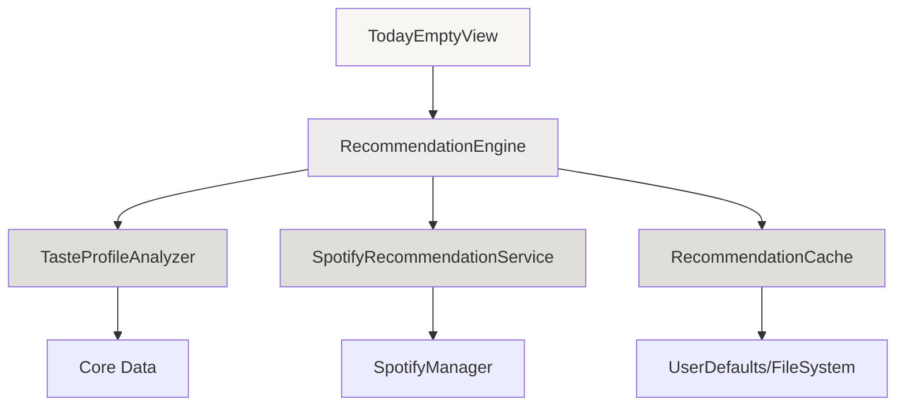
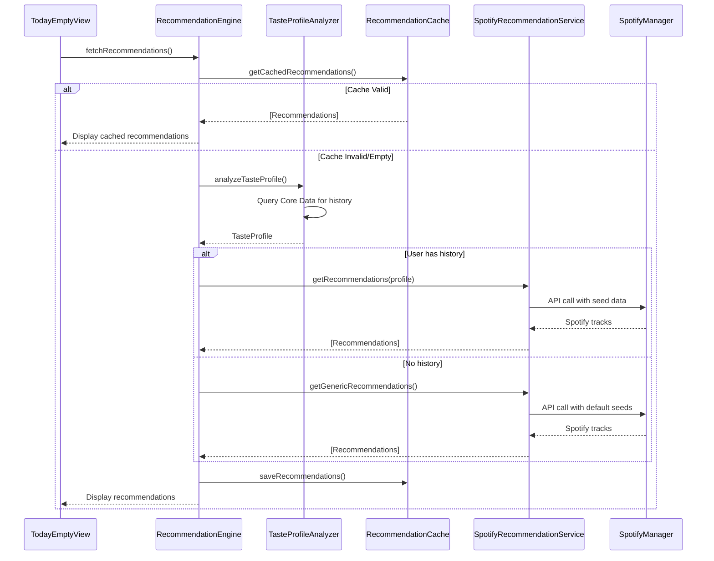
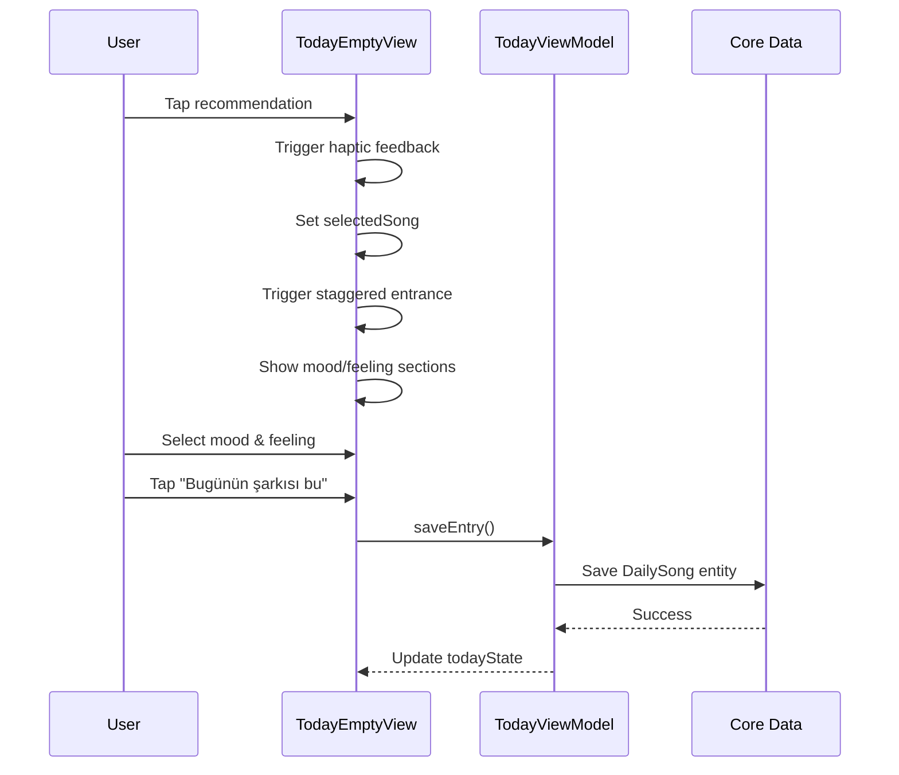

# Design Document: Personalized Song Recommendations

## Overview

This feature adds intelligent song recommendations to the ONE mood tracking app based on user listening history. When users open the "Bugün" (Today) section without having selected a song yet, they will see 5-10 personalized recommendations derived from their past selections (genres, artists, moods). The system analyzes Core Data entries to build a taste profile, uses Spotify's recommendation API to fetch curated suggestions, and caches results to minimize API calls. The UI follows the app's wabi-sabi design philosophy with minimal, elegant presentation. If a user has no history, the system falls back to generic recommendations.

## Architecture



## Sequence Diagrams

### Main Recommendation Flow




### User Selection Flow



## Components and Interfaces

### Component 1: RecommendationEngine

**Purpose**: Orchestrates the recommendation process, coordinates between taste analysis, Spotify API, and caching.

**Interface**:
```swift
@MainActor
class RecommendationEngine: ObservableObject {
    @Published var recommendations: [SongRecommendation] = []
    @Published var isLoading: Bool = false
    @Published var error: RecommendationError?
    
    func fetchRecommendations() async
    func refreshRecommendations() async
    func clearCache()
}
```

**Responsibilities**:
- Coordinate recommendation fetching workflow
- Manage loading and error states
- Decide between cached and fresh recommendations
- Handle fallback to generic recommendations

### Component 2: TasteProfileAnalyzer

**Purpose**: Analyzes user's listening history from Core Data to build a taste profile.

**Interface**:
```swift
struct TasteProfileAnalyzer {
    func analyzeTasteProfile(context: NSManagedObjectContext) async -> TasteProfile?
    func extractTopGenres(from entries: [DailySong], limit: Int) -> [String]
    func extractTopArtists(from entries: [DailySong], limit: Int) -> [String]
    func extractMoodPatterns(from entries: [DailySong]) -> [MoodPattern]
}
```

**Responsibilities**:
- Query Core Data for user's song history
- Calculate genre frequency distribution
- Identify top artists
- Detect mood patterns and preferences
- Return nil if insufficient data (< 3 entries)


### Component 3: SpotifyRecommendationService

**Purpose**: Interfaces with Spotify API to fetch personalized or generic recommendations.

**Interface**:
```swift
class SpotifyRecommendationService {
    func getRecommendations(
        profile: TasteProfile,
        limit: Int
    ) async throws -> [SpotifyTrack]
    
    func getGenericRecommendations(
        limit: Int
    ) async throws -> [SpotifyTrack]
    
    func getRecommendationsBySeeds(
        seedArtists: [String],
        seedGenres: [String],
        seedTracks: [String],
        limit: Int
    ) async throws -> [SpotifyTrack]
}
```

**Responsibilities**:
- Call Spotify's `/recommendations` endpoint
- Transform TasteProfile into Spotify seed parameters
- Handle API errors and rate limiting
- Provide fallback generic recommendations
- Map SpotifyTrack to SongRecommendation

### Component 4: RecommendationCache

**Purpose**: Caches recommendations to reduce API calls and improve performance.

**Interface**:
```swift
class RecommendationCache {
    func getCachedRecommendations() -> [SongRecommendation]?
    func saveRecommendations(_ recommendations: [SongRecommendation])
    func isCacheValid() -> Bool
    func clearCache()
    func getCacheAge() -> TimeInterval
}
```

**Responsibilities**:
- Store recommendations in UserDefaults or file system
- Track cache timestamp
- Validate cache freshness (24-hour expiry)
- Serialize/deserialize recommendation data
- Clear stale cache automatically

### Component 5: RecommendationCardView

**Purpose**: UI component to display a single recommendation in the wabi-sabi design style.

**Interface**:
```swift
struct RecommendationCardView: View {
    let recommendation: SongRecommendation
    let onTap: () -> Void
    
    var body: some View
}
```

**Responsibilities**:
- Display song artwork, name, artist
- Show subtle "Recommended" badge
- Handle tap gesture with haptic feedback
- Animate selection state
- Match app's minimal aesthetic


### Component 6: RecommendationsSection

**Purpose**: Container view that displays the recommendation list in TodayEmptyView.

**Interface**:
```swift
struct RecommendationsSection: View {
    @ObservedObject var engine: RecommendationEngine
    let onSelectSong: (SongRecommendation) -> Void
    
    var body: some View
}
```

**Responsibilities**:
- Display "Senin için seçtik" header
- Show loading state with skeleton UI
- Render horizontal scrollable recommendation cards
- Handle error states gracefully
- Trigger recommendation refresh

## Data Models

### Model 1: TasteProfile

```swift
struct TasteProfile: Codable {
    let topGenres: [String]           // Max 5 genres
    let topArtists: [String]          // Max 5 artists
    let moodPatterns: [MoodPattern]   // Mood frequency data
    let totalEntries: Int             // Total songs in history
    let averageMoodScore: Double      // 0.0-1.0 (dark to light)
    let createdAt: Date
}
```

**Validation Rules**:
- topGenres must have 1-5 elements
- topArtists must have 1-5 elements
- totalEntries must be >= 3 for valid profile
- averageMoodScore must be in range [0.0, 1.0]

### Model 2: MoodPattern

```swift
struct MoodPattern: Codable {
    let moodKey: String               // e.g., "mutlu", "huzurlu"
    let frequency: Int                // Number of times selected
    let percentage: Double            // Percentage of total entries
}
```

**Validation Rules**:
- frequency must be > 0
- percentage must be in range [0.0, 1.0]
- Sum of all percentages should equal 1.0

### Model 3: SongRecommendation

```swift
struct SongRecommendation: Identifiable, Codable {
    let id: String                    // Spotify track ID
    let name: String                  // Song name
    let artist: String                // Artist name(s)
    let coverURL: URL?                // Album artwork URL
    let spotifyURL: String?           // Spotify track URL
    let genre: String?                // Primary genre
    let recommendationReason: String? // e.g., "Based on your love for indie"
}
```

**Validation Rules**:
- id must be non-empty
- name must be non-empty
- artist must be non-empty
- coverURL should be valid URL if present


### Model 4: RecommendationError

```swift
enum RecommendationError: Error, LocalizedError {
    case notAuthenticated
    case insufficientHistory
    case spotifyAPIError(String)
    case networkError
    case cacheError
    
    var errorDescription: String? {
        switch self {
        case .notAuthenticated:
            return "Spotify'a giriş yapılmadı"
        case .insufficientHistory:
            return "Henüz yeterli dinleme geçmişin yok"
        case .spotifyAPIError(let message):
            return "Spotify hatası: \(message)"
        case .networkError:
            return "İnternet bağlantısı yok"
        case .cacheError:
            return "Önbellek hatası"
        }
    }
}
```

### Model 5: CachedRecommendations

```swift
struct CachedRecommendations: Codable {
    let recommendations: [SongRecommendation]
    let timestamp: Date
    let profileSnapshot: TasteProfile?
    
    func isValid(maxAge: TimeInterval = 86400) -> Bool {
        return Date().timeIntervalSince(timestamp) < maxAge
    }
}
```

**Validation Rules**:
- recommendations must have 1-10 elements
- timestamp must not be in the future
- Cache is valid for 24 hours (86400 seconds)

## Algorithmic Pseudocode

### Main Recommendation Algorithm

```swift
// ALGORITHM: fetchRecommendations
// INPUT: None (uses Core Data context and SpotifyManager)
// OUTPUT: Array of SongRecommendation
// PRECONDITIONS:
//   - Core Data context is available
//   - SpotifyManager is initialized
// POSTCONDITIONS:
//   - recommendations array is populated (5-10 items)
//   - isLoading is false
//   - error is set if failure occurs

func fetchRecommendations() async {
    // Step 1: Set loading state
    isLoading = true
    error = nil
    
    // Step 2: Check cache validity
    if cache.isCacheValid() {
        if let cached = cache.getCachedRecommendations() {
            recommendations = cached
            isLoading = false
            return
        }
    }
    
    // Step 3: Check Spotify authentication
    guard SpotifyManager.shared.isAuthenticated else {
        error = .notAuthenticated
        isLoading = false
        return
    }
    
    // Step 4: Analyze taste profile
    let profile = await tasteAnalyzer.analyzeTasteProfile(context: coreDataContext)
    
    // Step 5: Fetch recommendations based on profile
    do {
        let tracks: [SpotifyTrack]
        
        if let profile = profile, profile.totalEntries >= 3 {
            // User has sufficient history - personalized recommendations
            tracks = try await spotifyService.getRecommendations(
                profile: profile,
                limit: 8
            )
        } else {
            // Insufficient history - generic recommendations
            tracks = try await spotifyService.getGenericRecommendations(
                limit: 8
            )
        }
        
        // Step 6: Transform to SongRecommendation
        recommendations = tracks.map { track in
            SongRecommendation(
                id: track.id,
                name: track.name,
                artist: track.artistName,
                coverURL: track.album.artworkURL,
                spotifyURL: track.externalUrls?.spotify,
                genre: nil,
                recommendationReason: generateReason(track, profile)
            )
        }
        
        // Step 7: Cache results
        cache.saveRecommendations(recommendations)
        
    } catch {
        self.error = mapError(error)
    }
    
    isLoading = false
}
```

**Preconditions**:
- Core Data context is accessible and valid
- SpotifyManager singleton is initialized
- Network connectivity is available

**Postconditions**:
- recommendations array contains 5-10 items OR error is set
- isLoading is always set to false at completion
- Cache is updated if fetch succeeds
- UI state is consistent (either showing data or error)

**Loop Invariants**: N/A (no explicit loops in main algorithm)


### Taste Profile Analysis Algorithm

```swift
// ALGORITHM: analyzeTasteProfile
// INPUT: NSManagedObjectContext
// OUTPUT: TasteProfile? (nil if insufficient data)
// PRECONDITIONS:
//   - context is valid and accessible
//   - DailySong entity exists in Core Data
// POSTCONDITIONS:
//   - Returns TasteProfile if >= 3 entries exist
//   - Returns nil if < 3 entries
//   - No side effects on Core Data

func analyzeTasteProfile(context: NSManagedObjectContext) async -> TasteProfile? {
    // Step 1: Fetch all DailySong entries
    let fetchRequest: NSFetchRequest<DailySong> = DailySong.fetchRequest()
    fetchRequest.sortDescriptors = [NSSortDescriptor(key: "date", ascending: false)]
    
    guard let entries = try? context.fetch(fetchRequest) else {
        return nil
    }
    
    // Step 2: Check minimum threshold
    guard entries.count >= 3 else {
        return nil
    }
    
    // Step 3: Extract top genres
    var genreFrequency: [String: Int] = [:]
    for entry in entries {
        if let genre = entry.genre, !genre.isEmpty {
            genreFrequency[genre, default: 0] += 1
        }
    }
    
    let topGenres = genreFrequency
        .sorted { $0.value > $1.value }
        .prefix(5)
        .map { $0.key }
    
    // Step 4: Extract top artists
    var artistFrequency: [String: Int] = [:]
    for entry in entries {
        if let artist = entry.artistName, !artist.isEmpty {
            artistFrequency[artist, default: 0] += 1
        }
    }
    
    let topArtists = artistFrequency
        .sorted { $0.value > $1.value }
        .prefix(5)
        .map { $0.key }
    
    // Step 5: Calculate mood patterns
    var moodFrequency: [String: Int] = [:]
    var totalMoodScore: Double = 0.0
    var moodCount = 0
    
    for entry in entries {
        if let moodLabel = entry.moodLabel, !moodLabel.isEmpty {
            moodFrequency[moodLabel, default: 0] += 1
        }
        
        if entry.moodIsDark {
            totalMoodScore += 0.0  // Dark mood = 0
        } else {
            totalMoodScore += 1.0  // Light mood = 1
        }
        moodCount += 1
    }
    
    let moodPatterns = moodFrequency.map { key, value in
        MoodPattern(
            moodKey: key,
            frequency: value,
            percentage: Double(value) / Double(entries.count)
        )
    }.sorted { $0.frequency > $1.frequency }
    
    let averageMoodScore = moodCount > 0 ? totalMoodScore / Double(moodCount) : 0.5
    
    // Step 6: Build and return profile
    return TasteProfile(
        topGenres: Array(topGenres),
        topArtists: Array(topArtists),
        moodPatterns: moodPatterns,
        totalEntries: entries.count,
        averageMoodScore: averageMoodScore,
        createdAt: Date()
    )
}
```

**Preconditions**:
- context is a valid NSManagedObjectContext
- DailySong entity is defined in Core Data model
- context.fetch() can be called safely

**Postconditions**:
- Returns TasteProfile if entries.count >= 3
- Returns nil if entries.count < 3
- topGenres contains 0-5 elements
- topArtists contains 0-5 elements
- averageMoodScore is in range [0.0, 1.0]
- No mutations to Core Data

**Loop Invariants**:
- For genre extraction loop: genreFrequency accurately reflects counts of all processed entries
- For artist extraction loop: artistFrequency accurately reflects counts of all processed entries
- For mood calculation loop: totalMoodScore and moodCount remain synchronized


### Spotify Recommendation Fetching Algorithm

```swift
// ALGORITHM: getRecommendations
// INPUT: TasteProfile, limit: Int
// OUTPUT: Array of SpotifyTrack
// PRECONDITIONS:
//   - SpotifyManager.shared.isAuthenticated == true
//   - SpotifyManager.shared.accessToken != nil
//   - profile.topGenres or profile.topArtists is non-empty
//   - limit is in range [1, 100]
// POSTCONDITIONS:
//   - Returns array of SpotifyTrack (up to limit items)
//   - Throws RecommendationError on failure
//   - No side effects on profile or SpotifyManager state

func getRecommendations(profile: TasteProfile, limit: Int) async throws -> [SpotifyTrack] {
    guard let token = SpotifyManager.shared.accessToken else {
        throw RecommendationError.notAuthenticated
    }
    
    // Step 1: Prepare seed parameters (Spotify allows max 5 seeds total)
    var seedGenres: [String] = []
    var seedArtists: [String] = []
    
    // Take up to 3 genres
    seedGenres = Array(profile.topGenres.prefix(3))
    
    // Take up to 2 artists (to stay within 5 seed limit)
    seedArtists = Array(profile.topArtists.prefix(2))
    
    // Step 2: Build URL with query parameters
    var components = URLComponents(string: "https://api.spotify.com/v1/recommendations")!
    var queryItems: [URLQueryItem] = []
    
    if !seedGenres.isEmpty {
        queryItems.append(URLQueryItem(
            name: "seed_genres",
            value: seedGenres.joined(separator: ",")
        ))
    }
    
    if !seedArtists.isEmpty {
        // Note: Spotify expects artist IDs, not names
        // We'll need to resolve artist names to IDs first
        let artistIds = try await resolveArtistIds(artistNames: seedArtists, token: token)
        if !artistIds.isEmpty {
            queryItems.append(URLQueryItem(
                name: "seed_artists",
                value: artistIds.joined(separator: ",")
            ))
        }
    }
    
    queryItems.append(URLQueryItem(name: "limit", value: String(limit)))
    
    // Add target parameters based on mood
    if profile.averageMoodScore > 0.6 {
        // User prefers upbeat/light moods
        queryItems.append(URLQueryItem(name: "target_valence", value: "0.7"))
        queryItems.append(URLQueryItem(name: "target_energy", value: "0.6"))
    } else if profile.averageMoodScore < 0.4 {
        // User prefers darker/calmer moods
        queryItems.append(URLQueryItem(name: "target_valence", value: "0.3"))
        queryItems.append(URLQueryItem(name: "target_energy", value: "0.4"))
    }
    
    components.queryItems = queryItems
    
    // Step 3: Make API request
    guard let url = components.url else {
        throw RecommendationError.spotifyAPIError("Invalid URL")
    }
    
    var request = URLRequest(url: url)
    request.httpMethod = "GET"
    request.setValue("Bearer \(token)", forHTTPHeaderField: "Authorization")
    
    let (data, response) = try await URLSession.shared.data(for: request)
    
    guard let httpResponse = response as? HTTPURLResponse else {
        throw RecommendationError.networkError
    }
    
    guard httpResponse.statusCode == 200 else {
        throw RecommendationError.spotifyAPIError("Status \(httpResponse.statusCode)")
    }
    
    // Step 4: Parse response
    let decoder = JSONDecoder()
    let recommendationResponse = try decoder.decode(SpotifyRecommendationResponse.self, from: data)
    
    return recommendationResponse.tracks
}
```

**Preconditions**:
- SpotifyManager is authenticated with valid access token
- profile contains at least one genre or artist
- limit is positive integer <= 100
- Network connectivity is available

**Postconditions**:
- Returns array of SpotifyTrack with length <= limit
- Throws RecommendationError if authentication fails
- Throws RecommendationError if API returns non-200 status
- No mutations to input parameters

**Loop Invariants**: N/A (no explicit loops in main flow)


### Cache Validation Algorithm

```swift
// ALGORITHM: isCacheValid
// INPUT: None (uses internal cache state)
// OUTPUT: Bool
// PRECONDITIONS:
//   - Cache storage is accessible (UserDefaults or FileSystem)
// POSTCONDITIONS:
//   - Returns true if cache exists and age < 24 hours
//   - Returns false otherwise
//   - No side effects on cache state

func isCacheValid() -> Bool {
    // Step 1: Load cached data
    guard let data = UserDefaults.standard.data(forKey: "cached_recommendations") else {
        return false
    }
    
    // Step 2: Decode cached recommendations
    let decoder = JSONDecoder()
    guard let cached = try? decoder.decode(CachedRecommendations.self, from: data) else {
        return false
    }
    
    // Step 3: Check age (24 hours = 86400 seconds)
    let age = Date().timeIntervalSince(cached.timestamp)
    let maxAge: TimeInterval = 86400
    
    return age < maxAge
}
```

**Preconditions**:
- UserDefaults is accessible
- No concurrent writes to cache key

**Postconditions**:
- Returns true if and only if cache exists and is fresh
- Returns false if cache missing, corrupted, or stale
- No mutations to UserDefaults

**Loop Invariants**: N/A

## Key Functions with Formal Specifications

### Function 1: extractTopGenres()

```swift
func extractTopGenres(from entries: [DailySong], limit: Int) -> [String]
```

**Preconditions:**
- entries is a valid array (may be empty)
- limit is positive integer

**Postconditions:**
- Returns array of genre strings
- Result length <= min(limit, unique genres in entries)
- Genres are sorted by frequency (descending)
- Empty genres are filtered out
- No duplicate genres in result

**Loop Invariants:**
- For frequency counting loop: genreFrequency accurately reflects all processed entries

### Function 2: saveRecommendations()

```swift
func saveRecommendations(_ recommendations: [SongRecommendation])
```

**Preconditions:**
- recommendations is non-empty array
- UserDefaults is accessible

**Postconditions:**
- Recommendations are serialized and stored in UserDefaults
- Timestamp is set to current date
- Previous cache is overwritten
- If encoding fails, no partial data is written

**Loop Invariants:** N/A


### Function 3: resolveArtistIds()

```swift
func resolveArtistIds(artistNames: [String], token: String) async throws -> [String]
```

**Preconditions:**
- artistNames is non-empty array
- token is valid Spotify access token
- Network connectivity is available

**Postconditions:**
- Returns array of Spotify artist IDs
- Result length <= artistNames.length
- If artist not found, it's omitted from result
- Throws error if API call fails completely

**Loop Invariants:**
- For each artist search: accumulated IDs correspond to successfully resolved artists

### Function 4: generateReason()

```swift
func generateReason(_ track: SpotifyTrack, _ profile: TasteProfile?) -> String?
```

**Preconditions:**
- track is valid SpotifyTrack
- profile may be nil

**Postconditions:**
- Returns localized reason string if profile exists
- Returns nil if profile is nil
- Reason is based on genre/artist match
- String is in Turkish language

**Loop Invariants:** N/A

## Example Usage

### Example 1: Basic Recommendation Flow

```swift
// In TodayEmptyView
@StateObject private var recommendationEngine = RecommendationEngine()

var body: some View {
    VStack {
        // Existing song search UI
        songSearchSection
        
        // New recommendations section
        if !recommendationEngine.recommendations.isEmpty {
            RecommendationsSection(
                engine: recommendationEngine,
                onSelectSong: { recommendation in
                    // Convert recommendation to SongResult
                    selectedSong = SongResult(
                        id: recommendation.id,
                        name: recommendation.name,
                        artist: recommendation.artist,
                        coverURL: recommendation.coverURL,
                        spotifyURL: recommendation.spotifyURL
                    )
                    triggerStaggeredEntrance()
                }
            )
        }
    }
    .task {
        await recommendationEngine.fetchRecommendations()
    }
}
```

### Example 2: Handling Errors

```swift
if let error = recommendationEngine.error {
    switch error {
    case .notAuthenticated:
        Text("Spotify'a giriş yapman gerekiyor")
            .font(.custom("GeistMono-Regular", size: 10))
            .foregroundColor(Color(hex: "#E84040"))
    case .insufficientHistory:
        Text("Daha fazla şarkı seç, sana özel öneriler gelsin")
            .font(.custom("GeistMono-Regular", size: 10))
            .foregroundColor(Color(hex: "#BFBDB5"))
    default:
        Text("Öneriler yüklenemedi")
            .font(.custom("GeistMono-Regular", size: 10))
            .foregroundColor(Color(hex: "#E84040"))
    }
}
```


### Example 3: Manual Refresh

```swift
Button(action: {
    Task {
        await recommendationEngine.refreshRecommendations()
    }
}) {
    HStack(spacing: 6) {
        Image(systemName: "arrow.clockwise")
            .font(.system(size: 10))
        Text("Yenile")
            .font(.custom("GeistMono-Regular", size: 10))
    }
    .foregroundColor(Color(hex: "#BFBDB5"))
}
```

### Example 4: Cache Management

```swift
// Clear cache when user logs out of Spotify
func handleSpotifyLogout() {
    SpotifyManager.shared.logout()
    recommendationEngine.clearCache()
    recommendationEngine.recommendations = []
}

// Clear cache when user manually requests fresh recommendations
func forceRefresh() {
    recommendationEngine.clearCache()
    Task {
        await recommendationEngine.fetchRecommendations()
    }
}
```

## Correctness Properties

### Property 1: Cache Consistency
```swift
// For all valid cache states:
// If cache.isCacheValid() returns true, then cache.getCachedRecommendations() returns non-nil
assert(cache.isCacheValid() implies cache.getCachedRecommendations() != nil)
```

### Property 2: Recommendation Count Bounds
```swift
// For all successful fetchRecommendations() calls:
// recommendations.count is in range [1, 10]
assert(recommendations.count >= 1 && recommendations.count <= 10)
```

### Property 3: Profile Validity
```swift
// For all TasteProfile instances:
// If profile exists, then totalEntries >= 3
assert(profile != nil implies profile.totalEntries >= 3)
```

### Property 4: Mood Score Range
```swift
// For all TasteProfile instances:
// averageMoodScore is in range [0.0, 1.0]
assert(profile.averageMoodScore >= 0.0 && profile.averageMoodScore <= 1.0)
```

### Property 5: Authentication Requirement
```swift
// For all getRecommendations() calls:
// If SpotifyManager is not authenticated, then function throws notAuthenticated error
assert(!SpotifyManager.shared.isAuthenticated implies throws RecommendationError.notAuthenticated)
```

### Property 6: Cache Expiry
```swift
// For all cache states:
// If cache age > 24 hours, then isCacheValid() returns false
assert(cache.getCacheAge() > 86400 implies !cache.isCacheValid())
```

### Property 7: Seed Limit Compliance
```swift
// For all Spotify API calls:
// Total seeds (genres + artists + tracks) <= 5
assert(seedGenres.count + seedArtists.count + seedTracks.count <= 5)
```

### Property 8: Fallback Guarantee
```swift
// For all fetchRecommendations() calls:
// If user has insufficient history, generic recommendations are fetched
assert(profile == nil || profile.totalEntries < 3 implies usesGenericRecommendations)
```


## Error Handling

### Error Scenario 1: Spotify Not Authenticated

**Condition**: User has not logged into Spotify or token has expired
**Response**: 
- Display friendly message: "Spotify'a giriş yapman gerekiyor"
- Show "Giriş Yap" button that triggers SpotifyManager.shared.authenticate()
- Do not show recommendations section
**Recovery**: User taps login button, completes OAuth flow, recommendations auto-load

### Error Scenario 2: Insufficient History

**Condition**: User has < 3 songs in their history
**Response**:
- Fetch generic recommendations instead of personalized
- Display subtle message: "Daha fazla şarkı seç, sana özel öneriler gelsin"
- Show generic recommendations with "Keşfet" badge instead of "Senin için"
**Recovery**: As user adds more songs, system automatically switches to personalized recommendations

### Error Scenario 3: Network Error

**Condition**: No internet connectivity or Spotify API is unreachable
**Response**:
- Check if cached recommendations exist and are valid
- If cache exists: Show cached recommendations with subtle "Önbellekten" indicator
- If no cache: Display error message with retry button
**Recovery**: User taps retry button or network reconnects automatically

### Error Scenario 4: Spotify API Rate Limit

**Condition**: Too many API requests in short time period
**Response**:
- Use cached recommendations if available
- If no cache: Display message "Çok fazla istek, lütfen biraz bekle"
- Implement exponential backoff for retries
**Recovery**: Wait for rate limit window to reset (typically 30 seconds), auto-retry

### Error Scenario 5: Invalid Artist/Genre Seeds

**Condition**: Spotify API rejects seed parameters (invalid genre names, artist IDs not found)
**Response**:
- Log error for debugging
- Fall back to generic recommendations
- Do not show error to user (graceful degradation)
**Recovery**: System automatically uses fallback, user sees recommendations without knowing about error

### Error Scenario 6: Cache Corruption

**Condition**: Cached data is corrupted or cannot be decoded
**Response**:
- Clear corrupted cache
- Fetch fresh recommendations from API
- Log error for monitoring
**Recovery**: System automatically recovers by fetching new data

## Testing Strategy

### Unit Testing Approach

**Key Test Cases**:

1. **TasteProfileAnalyzer Tests**
   - Test with 0, 1, 2, 3, 10, 100 entries
   - Verify nil returned for < 3 entries
   - Verify genre frequency calculation accuracy
   - Verify artist frequency calculation accuracy
   - Verify mood score calculation (all dark, all light, mixed)
   - Test with missing/nil genre or artist fields

2. **RecommendationCache Tests**
   - Test cache save and retrieve
   - Test cache expiry (fresh vs stale)
   - Test cache invalidation
   - Test with corrupted data
   - Test concurrent access scenarios

3. **SpotifyRecommendationService Tests**
   - Mock Spotify API responses
   - Test successful recommendation fetch
   - Test error handling (401, 429, 500 status codes)
   - Test seed parameter construction
   - Test artist ID resolution

4. **RecommendationEngine Tests**
   - Test full recommendation flow
   - Test cache-first behavior
   - Test fallback to generic recommendations
   - Test error state management
   - Test loading state transitions

**Coverage Goals**: 
- Aim for 80%+ code coverage
- 100% coverage for critical paths (taste analysis, API calls, caching)


### Property-Based Testing Approach

**Property Test Library**: swift-check (Swift port of QuickCheck)

**Property Tests**:

1. **Cache Validity Property**
```swift
property("Cache validity is consistent with age") {
    forAll { (timestamp: Date) in
        let cache = CachedRecommendations(
            recommendations: generateRandomRecommendations(),
            timestamp: timestamp,
            profileSnapshot: nil
        )
        
        let age = Date().timeIntervalSince(timestamp)
        let isValid = cache.isValid()
        
        return (age < 86400) == isValid
    }
}
```

2. **Genre Frequency Property**
```swift
property("Top genres are sorted by frequency") {
    forAll { (entries: [DailySong]) in
        let analyzer = TasteProfileAnalyzer()
        let topGenres = analyzer.extractTopGenres(from: entries, limit: 5)
        
        // Verify descending order
        for i in 0..<(topGenres.count - 1) {
            let freq1 = entries.filter { $0.genre == topGenres[i] }.count
            let freq2 = entries.filter { $0.genre == topGenres[i+1] }.count
            if freq1 < freq2 { return false }
        }
        return true
    }
}
```

3. **Mood Score Bounds Property**
```swift
property("Average mood score is always in [0.0, 1.0]") {
    forAll { (entries: [DailySong]) in
        guard let profile = await analyzer.analyzeTasteProfile(context: context) else {
            return true  // nil is valid for < 3 entries
        }
        
        return profile.averageMoodScore >= 0.0 && profile.averageMoodScore <= 1.0
    }
}
```

4. **Recommendation Count Property**
```swift
property("Recommendations count respects limit") {
    forAll { (limit: Int) in
        guard limit > 0 && limit <= 100 else { return true }
        
        let tracks = try? await service.getRecommendations(
            profile: validProfile,
            limit: limit
        )
        
        return tracks?.count ?? 0 <= limit
    }
}
```

### Integration Testing Approach

**Integration Test Scenarios**:

1. **End-to-End Recommendation Flow**
   - Create test user with 10 song entries
   - Trigger recommendation fetch
   - Verify recommendations are returned
   - Verify cache is populated
   - Verify UI displays recommendations

2. **Spotify API Integration**
   - Test with real Spotify API (staging environment)
   - Verify authentication flow
   - Verify recommendation endpoint responses
   - Verify artist search endpoint responses
   - Test rate limiting behavior

3. **Core Data Integration**
   - Create in-memory Core Data stack
   - Populate with test data
   - Verify taste profile analysis
   - Verify no data corruption

4. **Cache Persistence**
   - Save recommendations
   - Restart app (simulate)
   - Verify cache is loaded correctly
   - Verify cache expiry works across app sessions

## Performance Considerations

### API Call Optimization

**Strategy**: Minimize Spotify API calls through aggressive caching
- Cache recommendations for 24 hours
- Only refresh when cache expires or user explicitly requests
- Batch artist ID resolution to reduce API calls

**Expected Performance**:
- First load: 1-2 seconds (includes API call)
- Subsequent loads: < 100ms (from cache)
- Cache hit rate target: > 90%

### Core Data Query Optimization

**Strategy**: Optimize taste profile analysis queries
- Use fetch request with sort descriptors
- Limit fetch to recent entries if history is very large (e.g., last 100 entries)
- Perform analysis on background thread to avoid UI blocking

**Expected Performance**:
- Taste profile analysis: < 200ms for 100 entries
- < 500ms for 1000 entries

### Memory Management

**Strategy**: Avoid loading large images into memory unnecessarily
- Use AsyncImage for lazy loading
- Limit recommendation count to 10 to control memory
- Clear cache when memory warning received

**Expected Memory Usage**:
- Recommendation data: < 50KB
- Images (10 album covers): ~500KB-1MB
- Total overhead: < 2MB


### UI Performance

**Strategy**: Smooth animations and responsive interactions
- Use lazy loading for recommendation cards
- Implement skeleton loading states
- Optimize SwiftUI view updates with proper @Published usage
- Use .task modifier for async operations

**Expected Performance**:
- Recommendation card render: 60 FPS
- Tap response time: < 50ms
- Scroll performance: 60 FPS with 10 cards

## Security Considerations

### API Token Security

**Threat**: Spotify access token exposure
**Mitigation**:
- Store access token in Keychain (already implemented in SpotifyManager)
- Never log or expose token in error messages
- Use HTTPS for all API calls
- Implement token refresh before expiry

### Data Privacy

**Threat**: User listening history exposure
**Mitigation**:
- All taste profile analysis happens on-device
- No user data sent to third-party servers (except Spotify)
- Cache stored locally in app sandbox
- Clear cache on logout

### Input Validation

**Threat**: Malformed data from Spotify API
**Mitigation**:
- Validate all API responses before processing
- Use Codable with proper error handling
- Sanitize genre/artist strings before display
- Handle missing/nil fields gracefully

### Rate Limiting

**Threat**: Excessive API calls leading to account suspension
**Mitigation**:
- Implement 24-hour cache to limit calls
- Add exponential backoff for retries
- Monitor API usage in production
- Respect Spotify's rate limits (429 responses)

## Dependencies

### External Dependencies

1. **Spotify Web API**
   - Endpoint: `https://api.spotify.com/v1/recommendations`
   - Endpoint: `https://api.spotify.com/v1/search`
   - Authentication: OAuth 2.0 with PKCE (already implemented)
   - Rate Limits: ~180 requests per minute per user
   - Documentation: https://developer.spotify.com/documentation/web-api/reference/get-recommendations

2. **SpotifyManager** (existing)
   - Provides authentication and access token management
   - Provides search functionality
   - Handles OAuth flow

### Internal Dependencies

1. **Core Data**
   - DailySong entity for user history
   - NSManagedObjectContext for queries

2. **SwiftUI**
   - View rendering
   - State management with @Published
   - Async/await with .task modifier

3. **Foundation**
   - URLSession for networking
   - JSONDecoder for API responses
   - UserDefaults for caching

### Optional Dependencies

1. **swift-check** (for property-based testing)
   - Installation: Swift Package Manager
   - Used only in test target

2. **Kingfisher** (optional, for advanced image caching)
   - Could replace AsyncImage for better performance
   - Not required for MVP

## Implementation Notes

### Spotify API Seed Constraints

Spotify's recommendation API has specific constraints:
- Maximum 5 seeds total (combined genres + artists + tracks)
- Genres must be from Spotify's available genre list
- Artists must be specified by Spotify ID, not name
- Tracks must be specified by Spotify ID

**Design Decision**: Use 3 genre seeds + 2 artist seeds for personalized recommendations

### Genre Mapping

Spotify has a specific list of available seed genres. We need to map user's stored genres to Spotify's genre seeds:

**Common Mappings**:
- "Rock" → "rock"
- "Pop" → "pop"
- "Hip Hop" → "hip-hop"
- "Electronic" → "electronic"
- "Indie" → "indie"
- "Jazz" → "jazz"

**Fallback**: If genre not in Spotify's list, omit it and use more artist seeds

### Artist ID Resolution

Since Spotify requires artist IDs (not names), we need to resolve artist names to IDs:

**Approach**:
1. Use Spotify's `/search?type=artist` endpoint
2. Take first result for each artist name
3. Cache artist name → ID mappings to reduce API calls
4. If resolution fails, omit that artist seed

### Generic Recommendations

For users with insufficient history, use curated seed genres:

**Default Seeds**:
- Genres: ["indie", "alternative", "pop"]
- Target valence: 0.5 (neutral mood)
- Target energy: 0.5 (moderate energy)

This provides a balanced starting point for new users.

## Future Enhancements

1. **Time-of-Day Awareness**: Recommend upbeat songs in morning, calmer songs at night
2. **Collaborative Filtering**: Use Circle friends' listening patterns for recommendations
3. **Mood-Based Filtering**: Filter recommendations by current mood selection
4. **Explicit Feedback**: Allow users to like/dislike recommendations to improve future suggestions
5. **Playlist Integration**: Create Spotify playlists from user's ONE history
6. **Advanced Caching**: Use Core Data for cache instead of UserDefaults for better performance
7. **Offline Mode**: Pre-fetch recommendations when online for offline access
8. **A/B Testing**: Test different recommendation algorithms and seed strategies
